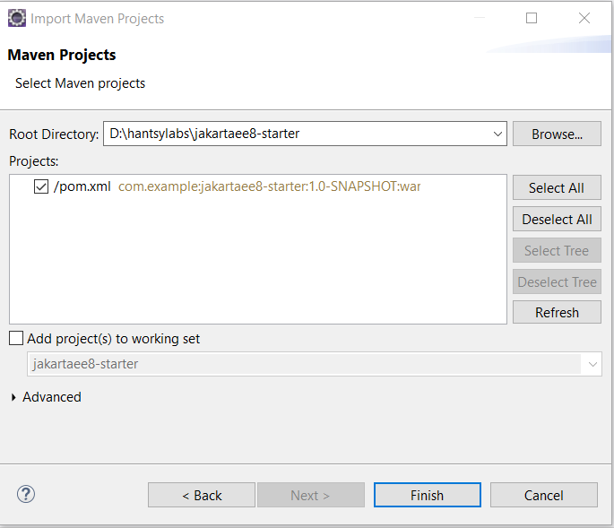
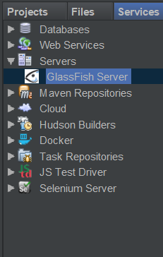
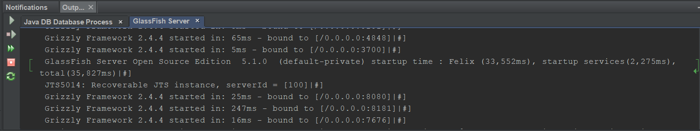
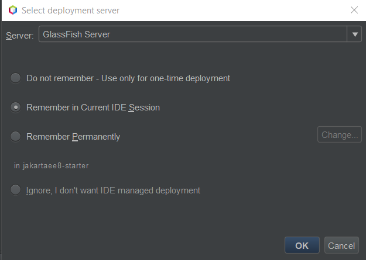
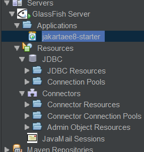

# Kickstart a Jakarta EE 8 Application
[Jakarta EE 8](https://jakarta.ee/) was released  at the first [Jakarta EE One](https://jakartaone.org/) online conference which was driven by Eclipse foundation. 

Jakarta EE 8 is the first version released by Eclipse Foundation.  Compared to the previous Java EE 8, the new Jakarta EE 8 neither introduced new specifications nor updated the existing ones , the main work was moving all specifications to  Eclipse foundation, and cleaning up the issues of license.  Now Jakarta EE is completely a community driven  project, more info about Jakarta EE 8, please navigate the official [Jakarta EE website](https://jakarta.ee/).  

This project - [Jakarta EE 8 starter](https://github.com/hantsy/jakartaee8-starter) is a boilerplate project to help you to bootstrap a new  Java EE 8/Jakarta EE 8 application in seconds.

 [](https://github.com/hantsy/jakartaee8-starter/actions)

[TOC]

## Prerequisites

Before starting a new Jakarta EE 8 project, I assume the following software have been installed into your local machine.

* The latest JDK 8, not limited to:
  * [Oracle JDK 8](https://java.oracle.com) 
  * community-driven [AdoptOpenJDK 8](https://adoptopenjdk.net/releases.html) 
  * Other JDK maintained by Redhat, etc.
* The latest of [Apache Maven 3](https://maven.apache.org) 
* One of the following Jakarta EE 8 compatible products to serve your application:
  * [Glassfish v5.1](https://projects.eclipse.org/projects/ee4j.glassfish/downloads)
  * [Payara Server 193 Full](https://www.payara.fish/software/downloads/)
  * [Wildfly 17.0.1](https://wildfly.org/downloads)
  * [OpenLiberty 19.0.0.9]( https://openliberty.io/downloads/)
* Your favorite IDEs, not limited to:
  * [Eclipse IDE](https://eclipse.org)
  * [Apache NetBeans IDE](http://netbeans.apache.org)
  * [Intellij IDEA ](https://www.jetbrains.net)

## Bootstrap a new Jakarta EE project

Click the [**Use this template**](https://github.com/hantsy/jakartaee8-starter/generate) button to use this project as template  and generate a new repository under  your Github account, them check out the source codes from your Github account.

```bash
git clone https://github.com/<your account>/<your jakartaee project>
```

Or check out the source codes of this project into your local system directly,  and push it back to your Github account later.

```bash
git clone https://github.com/hantsy/jakartaee8-starter
```

The source codes are built by Apache Maven.  Nowadays most of the popular IDEs support building with Apache Maven very well.

First of all, import the source codes into your  favorite IDE.

### Apache NetBeans

 NetBeans  can recognize Maven  project directly.

1. Open  *File->Open* Project, or click the *Open Project* icon button in the toolbar,  or use *Ctrl+Shift+O* shortcuts to start up the *Open Project* dialog.

2. Select the folder of the source codes, it should be displayed as a NetBeans  Maven project icon.

   

### Eclipse IDE

If Eclipse is your preferred IDE,  to get better experience of Java EE development, the [Eclipse IDE for Enterprise Java Developers](https://www.eclipse.org/downloads/packages/release/2019-09/r/eclipse-ide-enterprise-java-developers) is highly recommended. Or you can select a  commercial  version, such as [Red Hat CodeReady Studio](https://www.redhat.com/en/technologies/jboss-middleware/codeready-studio) which is free for developers.

1. Click *File-> Import...* from the main menu to open the *Import* dialog.
2. Select *Maven/Existing Maven Projects* in tree nodes, and click *Next* button to continue.
3. In the  *Import Maven projects*, select root folder of the source codes.

   
   
4. Click *Finish* button to import the project into the current Eclipse workspace.


### Intellij IDEA

Intellij IDEA has two versions, the free open-sourced community edition and the full-featured  commercial ultimate edition.  The community edition just contains basic features to develop Java application,  and includes essential supports of other languages, such as Groovy, Kotlin, etc.,   the later has richer support of building an enterprise application.  To work more productive, you should consider to buy a commercial  license. 

1. Click *File->New->Project from Existing Sources...*. from main menu.
2. In the *Select File or Directory  to Import...* dialog, select the folder node of the source codes, click *Ok* button.
3. In the *Import project...* dialog, choose the *Import from external model* option, and then select *Maven* in list, click *Finish* button.

If it is the first time to create a Jakarta EE 8 project, it will take some time to resolve the Maven dependencies,  please be patient and wait for seconds.

## Explore the Sample Codes

Now let's take a glance at the sample codes, by default the project file structure looks like the following:

```bash
├── .github
│   ├── ISSUE_TEMPLATE
│   │   └── bug_report.md
│   └── workflows
│       └── maven.yml
├── src
│   ├── main
│   │   ├── java
│   │   │   └── com
│   │   │       └── example
│   │   │           ├── GreetingMessage.java
│   │   │           ├── GreetingResource.java
│   │   │           ├── GreetingService.java
│   │   │           └── JaxrsActivator.java
│   │   └── resources
│   │       └── META-INF
│   │           └── beans.xml
│   └── test
│       ├── java
│       │   └── com
│       │       └── example
│       │           ├── it
│       │           │   ├── GreetingResourceTest.java
│       │           │   └── GreetingServiceTest.java
│       │           └── GreetingMessageTest.java
│       └── resources
│           └── arquillian.xml
├── .gitignore
├── LICENSE
├── pom.xml
└── README.md

```

The **.github** folder holds the Github specific configurations, eg, issue templates, Github Actions workflows. 

The *src/main/java* includes some sample codes:

*  `GreetingMessage` is a simple POJO to present a greeting message.  
* `GreetingService` is a simple CDI managed bean used to building a greeting message.  
*  `GreetingResource` is a simple JAX-RS resource to produce RESTful APIs. 
*  `JaxrsActivator` is the JAX-RS application class which is used to activate JAX-RS in Jakarta EE  applications.

The *src/main/java/resources/META-INF/beans.xml* is a CDI configuration file.

The *src/test/java* includes some ample codes for testing purpose.

The *src/test/java/resources/arquillian.xml*  is a [ JBoss Arquillian](http://arquillian.org/)  sample configuration file.

## Run the Sample Application

Apache NetBeans, Eclipse and Intellij IDEA have great Jakarta EE support, you can run the Jakarta EE applications in IDEs directly.

### Run in IDEs

#### Apache NetBeans 

NetBeans has built-in support for Glassfish and Payara server.  Firstly, you should add a Glassfish server instance in NetBeans.

1. Click *Windows->Services* or use *Ctrl+5* shortcuts to open *Services* view .
2. Right click  the *Servers* node, select *Add Server...* in the context menu.
3. In the *Add Server Instance* dialog, there are three steps:
   * *Choose Server* :select *Glassfish* in the server list, click *Next* button.
   * *Server Location*: select the Glassfish server location, click *Next* button.
   * *Domain name/Location*: use the default *domain1*  as domain name, click *Finish* button.

After it is done, there is a new node *Glassfish server* added under the *Server*s nodes.



Right click the Glassfish server node, there is a few actions available for you to control the server instance, such as Start, Stop, Debug etc. 

Let's start the Glassfish server by click *Start* in the context menu.  Wait for seconds, you will see the *Output* screen similar to the following.



Switch to  *Project* view, right click the project node, and select *Run* in the context menu.

In the  *Select deployment server*, select *Glassfish server* we have created in the dropdown menu.



It will try to build the project and deploy the application into the  Netbeans managed Glassfish server.   After it is deployed successfully, there is success message in the *Output* windows.

```bash
------------------------------------------------------------------------
Deploying on GlassFish Server
    profile mode: false
    debug mode: false
    force redeploy: true
In-place deployment at D:\hantsylabs\jakartaee8-starter\target\jakartaee8-starter

```

Let's switch to *Server* view, there several nodes are displayed under Glassfish servers. Expand the *Application* node, you will see there is a node *jakartaee8-starter* there.



Currently the application just serves a RESTful APIs at */api/greeting* endpoints. Open a terminal and use `curl`  or Postman to test the APIs.

```bash
curl http://localhost:8080/jakartaee8-starter/api/greeting/hantsy
{"message":"Say Hello to hantsy at 2019-11-04T16:16:13.509"}
```

Payara server is derived from Glassfish project, the steps of using Payara server in NetBeans is very similar with Glassfish server. Play it yourself.

Unfortunately at the moment of writing this post, the original Wildfly plugin is not aligned with Jakarta EE and not available in NetBeans Plugins,   and there is no Liberty support via NetBeans plugin. 

### Run by Maven CLI


## Resources 

* [WildFly Maven Plugin (wildfly-maven-plugin)](https://docs.jboss.org/wildfly/plugins/maven/latest/index.html)
* [Deploying to Payara Server Using the Maven Cargo Plugin](https://blog.payara.fish/deploying-to-payara-server-using-the-maven-cargo-plugin)  by Payara Blog
* [Cargo Maven2 Plugin for Glassfish v5](https://codehaus-cargo.github.io/cargo/GlassFish+5.x.html)