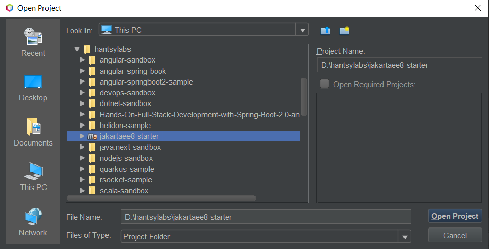
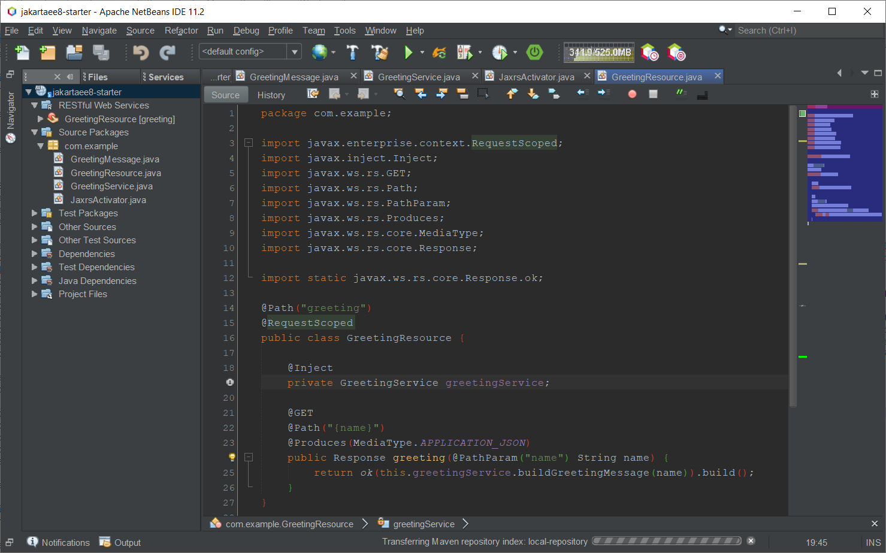

# Setup Local Development Environment

[toc]

## Prerequisites

Before starting a new Jakarta EE 8 project, make sure the following software have been installed in your local system.  

### Java 8 

There are a few options available.  

* [Oracle  JDK 8](https://java.oracle.com)
* [AdoptOpenJDK](https://adoptopenjdk.net/)
* [Redhat OpenJDK ](https://developers.redhat.com)

Additionally, [Azul](https://www.azul.com/downloads/zulu-community/),  [Amazon](https://aws.amazon.com/corretto/),  [Alibaba](https://github.com/alibaba/dragonwell8),  and [Microsoft](https://docs.microsoft.com/en-us/xamarin/android/get-started/installation/openjdk)  have maintained their own OpenJDK redistribution for their products. 

Personally I prefer the community-driven AdoptOpenJDK.

Download a  copy of [AdoptOpenJDK](https://adoptopenjdk.net/) redistribution, and install it into your local system.

Optionally,  create a new **JAVA\_HOME** environment variable and set its value as the location of the *&lt;JDK installation dir>*. And append path *&lt;JDK installation dir>/bin* to the  value of **PATH** environment variable, thus the java command will be available in PATH.

Open your terminal, run the following command to verify your Java environment is installed successfully.

```sh
#java -version
openjdk version "1.8.0_232"
OpenJDK Runtime Environment (AdoptOpenJDK)(build 1.8.0_232-b09)
OpenJDK 64-Bit Server VM (AdoptOpenJDK)(build 25.232-b09, mixed mode)
```

> At the moment, Java 13 was released for a while. But for building a Jakarta EE 8 application, Java 8 is highly recommended.  Some Jakarta EE application servers,  such as  Glassfish is not  compatible with the latest Java 13. 


### Apache Maven 

Download a copy of  the latest of [Apache Maven 3](https://maven.apache.org) , and extract the files into your local system. Optionally, set up a **M2\_HOME** environment variable, and also do not forget to append *&lt;Maven Installation dir>/bin* your **PATH** environment variable.  

Type the following command to verify if Apache Maven is working.

```shell
#mvn -v
Apache Maven 3.6.2 (40f52333136460af0dc0d7232c0dc0bcf0d9e117; 2019-08-27T23:06:16+08:00)
Maven home: D:\build\maven\bin\..
Java version: 1.8.0_232, vendor: AdoptOpenJDK, runtime: d:\JDK8\jre
Default locale: en_US, platform encoding: Cp1252
OS name: "windows 10", version: "10.0", arch: "amd64", family: "windows"
```


### Git client

Most of Linux distributions provide git in their official repositories, using the built-in package manager  to install them directly.

For Windows users, you should install [Git for Windows](https://gitforwindows.org/), which provides all runtime requirements of a Git command client, and a simple Git GUI and Git Bash tool.

After it is installed, use the following command to verify the installation.  

```bash
#git --version
git version 2.25.0.windows.1
```

Additionally, there are some popular GUI tools available for Git end users.

* [TortoiseGit](https://tortoisegit.org/)
* [Github Desktop](https://desktop.github.com/)
* [Sourcetree](https://www.sourcetreeapp.com/)
* [Git Extensions](https://gitextensions.github.io/)

A complete list of Git GUI tools can be found [here](https://git-scm.com/downloads/guis/).


##  Setup Development Tools

There are several java IDEs  and simple code editors available for coding Java.

*  [Eclipse IDE](https://eclipse.org)
*  [Apache NetBeans IDE](http://netbeans.apache.org)
*  [Intellij IDEA ](https://www.jetbrains.com/idea/) 
*  [VisualStudio Code](https://code.visualstudio.com)

### Apache NetBeans IDE

Apache NetBeans IDE is the easiest tools for building Java and Java EE/Jakarta EE applications. For those new to Java/Java EE, it is highly recommended.

### Eclipse IDE

Eclipse is one of the most popular IDEs in the world. To get better experience of Java EE development,  [Eclipse IDE for Enterprise Java Developers](https://www.eclipse.org/downloads/packages/release/2019-09/r/eclipse-ide-enterprise-java-developers) is highly recommended. 

Alternatively, you can select a  commercial  version, such as [Red Hat CodeReady Studio](https://www.redhat.com/en/technologies/jboss-middleware/codeready-studio) which is free for developers.

### Intellij IDEA

JetBrains provides two editions of Intellij IDEA, the Community Edition is free and open-sourced, the commercial Ultimate Edition requires a license.  The Community Edition just includes essential support for developing Java applications,  and it also includes basic supports of other languages, such as Groovy, Kotlin, Scala(through a plugin), etc.  The Ultimate Edition has richer features of building complex enterprise applications.  

If you are a big fan of IDEA,  to work more productive, you should consider to buy a commercial  license of Ultimate Edition.

### Visual Studio Code

If you are stick on simple code editors for coding, VS Code is really a good choice. 

Benefit from the effort of Microsoft and Redhat, VS Code also has great Java support via [Java extension pack](https://marketplace.visualstudio.com/items?itemName=vscjava.vscode-java-pack) , you can simply install it  from [VS Code marketpalce](https://marketplace.visualstudio.com/VSCode) in VS Code. 

VS Code team also provides an [installer of Visual Studio Code for Java developers](https://aka.ms/vscode-java-installer-win) to simplify the installation which packed all essential Java extensions into it.


## Preparing the project skeleton

Open your browser, and navigate to [Jakarta EE 8 Starter](https://github.com/hantsy/jakartaee8-starter) page, click  the [**Use this template**](https://github.com/hantsy/jakartaee8-starter/generate) button, it will guide your to create a new repository under  your Github account, and use this project as template to initialize the repository.

After it is done, you can check out the source codes from your Github account.

```bash
git clone https://github.com/<your account>/<your jakartaee project>
```

Or check out the source codes of [Jakarta EE 8 Starter](https://github.com/hantsy/jakartaee8-starter)  project into your local system directly,  then push it back to your Github account or somewhere later.

```bash
git clone https://github.com/hantsy/jakartaee8-starter
```

The project skeleton is ready, then import the source codes into your favorite IDE.

## Importing Source Codes into IDEs

Almost all IDEs, including Apache NetBeans IDE, Eclipse IDE and IntelliJ IDEA have great Maven support, and VS Code also has basic Maven support if you have installed the  [Java extension pack](https://marketplace.visualstudio.com/items?itemName=vscjava.vscode-java-pack) . 

### Apache NetBeans IDE

 NetBeans will recognize Maven project directly.

1. Open  *File->Open* Project from IDE main menu, or click the *Open Project* icon button in the toolbar,  or use *Ctrl+Shift+O* shortcuts to start up the *Open Project* dialog.

2. Select the folder of the source codes, it should be displayed as a NetBeans Maven project.

   

3. After the project is imported, it  will try to resolve dependencies and show the project source in a tree structure.

   

### Eclipse IDE

1. Click *File-> Import...* from the main menu to open the *Import* dialog.

2. Select *Maven/Existing Maven Projects* in tree nodes, and click *Next* button to continue.

3. In the  *Import Maven projects*, select root folder of the source codes.

   

4. Click *Finish* button to import the project into the current Eclipse workspace.


### Intellij IDEA

1. Click *File->New->Project from Existing Sources...*. from main menu.
2. In the *Select File or Directory  to Import...* dialog, select the folder node of the source codes, click *Ok* button.
3. In the *Import project...* dialog, choose the *Import from external model* option, and then select *Maven* in list, click *Finish* button.

If it is the first time to create a Jakarta EE 8 project, it will take some time to resolve the Maven dependencies,  please be patient and wait for a while.