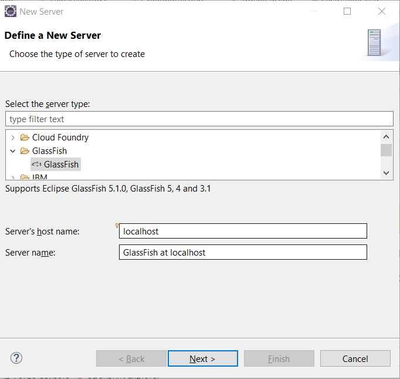
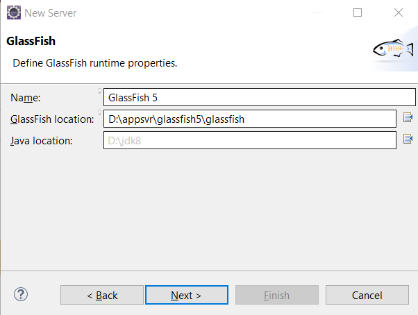
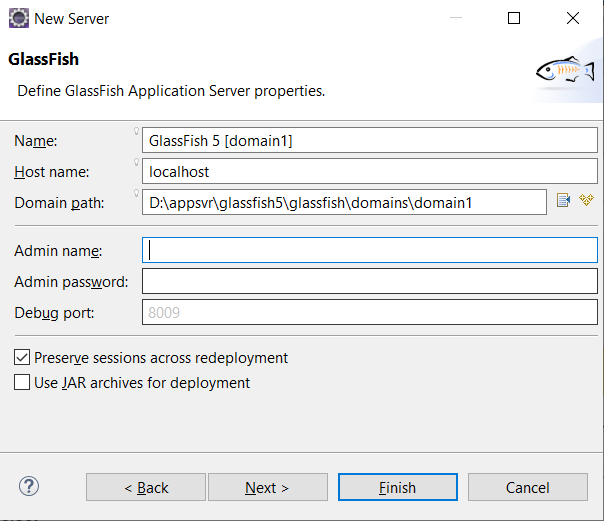
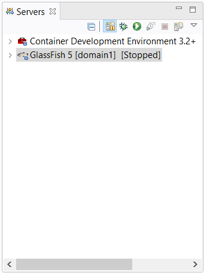
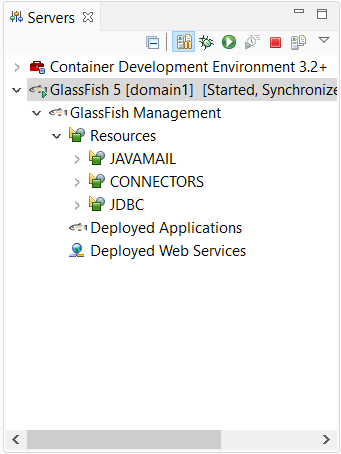
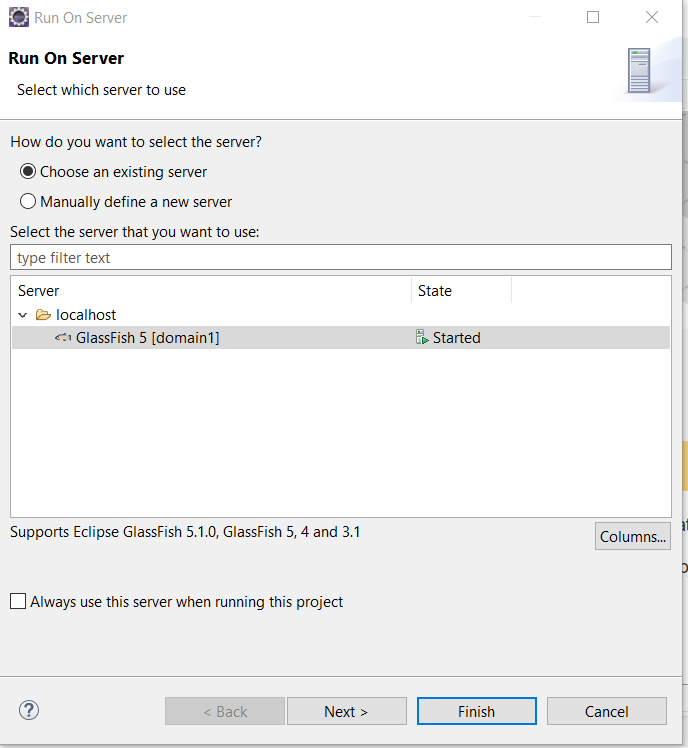

# Deploying applications to Glassfish Server using Eclipse IDE 

Follow the following steps to deploy and run the application on Glassfish in Eclipse IDE.

[toc]

## Installing Glassfish tools 

First of all, follow the following steps to  install [Eclipse Glassfish Tools](https://projects.eclipse.org/projects/webtools.glassfish-tools/) plugin into Eclipse IDE.

1. Open Eclipse Marketplace from *Help*-> *Eclipse Marketplace* menu. 
2. Type *Glassfish* in the search box to filter Glassfish plugins.
3. In the search result, find *Glassfish tools* ,  click the *Install* button to install it.
4. After it is installed, restart Eclipse IDE to apply the plugin.

Next let's create a Glassfish Server instance.

## Adding a Glassfish Server instance

If the *Servers* view is not opened, try to open it first.  Click *Windows*->*Show Views* -> *Servers* from Eclipse main menu.

Alternatively  try to open the Java EE Perspective, click *Windows*-> *Perspective*->*Open Perspective*-> *Other...* from the main menu, and find the *Java EE* perspective in the popup *Perspective* window, it will open a series of views for this perspective, including  the *Servers*  view.

In the *Servers* view, right click on the blank area, select *New*->*Server* in the context menu. It starts a *New Server* wizard to set up a server instance.



In the *New Server* wizard,  the first step is *Define a New Server*, select *Glassfish* in the server type tree,  and click *Next* button.



In the *Glassfish runtime properties* step, you can name the server instance, select the Glassfish location from local machine, and choose a JDK 8 to run Glassfish, click *Next* button.



In the *Glassfish Application Server properties* step, it allows you to setup domain info and the administration properties, let's use the default values, click *Finish* button. 

There is a new node will be appeared in the *Servers* view.



It is easy to control the application server in the *Servers* view, such as start, stop, restart, deploy and undeploy, etc. 

## Start and Stop Glassfish Server

Right click the *Glassfish* node, and select *Start* to start Glassfish server.  After it is  started successfully, under the Glassfish node, it will include the resources in the Glassfish server. 



To stop Glassfish Server, just click *Stop* in the context menu, or select *Glassfish* node, and click the *stop* button in the toolbar of the *Servers* view.


## Deploy and undeploy applications

Ok, let's try to run our sample application on the Glassish server.

In the *Project* or *Packages* view, right click the project node, and click *Run As...*-> *Run on Server*  in the context menu.



In the *Run on Server* dialog, select *Glassfish*, and click *Finish* button. Wait for seconds, it will build, package and deploy the application into Glassfish server. 

When it is done, you will see there is a *Deployed Applications* under the Glassfish node in the *Servers* view. Expand this node, there is a *jakartaee8-starter* node, it is our application running on the Glassfish server.


Open your terminal, try to access the sample endpoint `api/greeting/{name}` via `curl` command.

```bash 
curl http://localhost:8080/jakartaee8-starter/api/greeting/hantsy
{"message":"Say Hello to hantsy at 2019-12-03T14:05:28.437"}
```

To undeploy  the application, in *Servers* view, expand *Glassfish 5*->*Glassfish Management*->*Deployed Applications*,  right click *jakartaee8-starter*, click *Undeploy* in the context menu.

Or right click  *Glassfish 5*-> *jakartaee8-starter*,  click *Remove*  in the context menu.