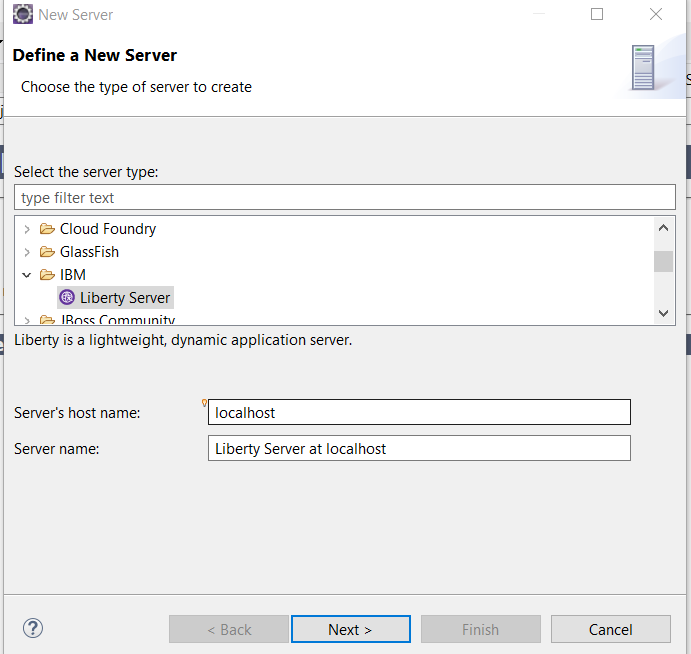
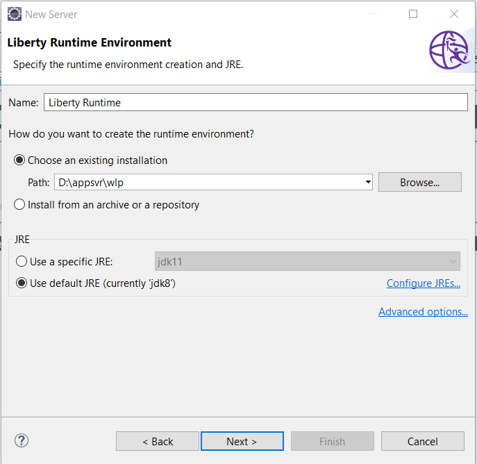
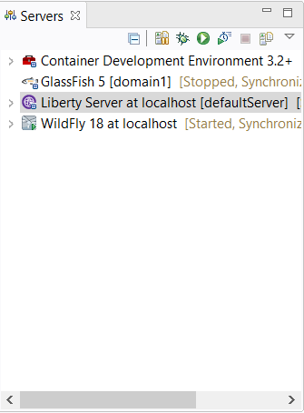
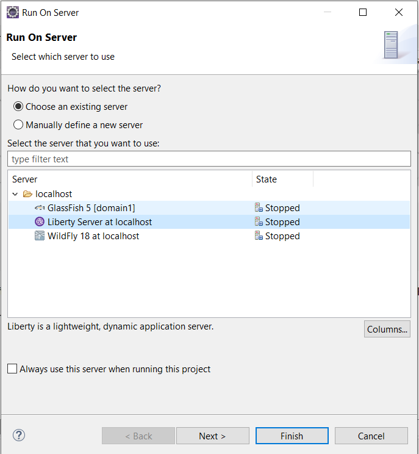

# Deploying applications to Open Liberty Server using Eclipse IDE 


## Install Open Liberty Developer Tools

To manage Open Liberty server in Eclipse IDE, you should install Open Liberty Developer tools pluign.

Follow the following steps to  install Open Liberty Developer Tools  plugin into Eclipse IDE.

1. Open Eclipse Marketplace from *Help*-> *Eclipse Marketplace* menu. 
2. Type *Liberty* in the search box and hit *Enter* to search it.
3. In the result list, find  *IBM Liberty Developer Tools* ,  then click *Install* button to start the installation.
4. After it is installed, restart Eclipse IDE to apply the plugin.

Next let's create an  Open Liberty Server instance.


## Add an Open Liberty Server instance

Right click on the blank area in the *Servers* view, select *New*->*Server* in the context menu.




Expand *IBM* node in the tree list, select *Liberty*, and click *Next*  button.



In the  *Liberty Runtime Environmentr* step,  set the Liberty location,  click *Next* button.


In the *New Liberty Server*,  there is a ** template** field, make sure  *javaee-8.0* is selected, others use the default values, click *Finish* button. 

After it is done, there is a Liberty Server instance in the  *Servers* view.




## Start and Stop Open Liberty Server

To start Open Liberty Server, right click the *LibertyServer* node in the *Servers* view, and click *Start*  in the context menu.

To stop Open Liberty Server, right click the *LibertyServer* node in the *Servers* view, and click *Stop*  in the context menu.

## Deploy and undeploy application

Ok, let's try to run the application on Open Liberty server.

In the *Project* or *Packages* view, right click the project node, and click *Run As...*-> *Run on Server*.



If the Liberty server is not started, it will start the server firstly, then build, package and deploy the application into the Liberty Server.

If it is first time to run Liberty server, it will popup a dialog for you to setup the keystore. Set up  it as you like.

After it is started successfully, you can see the following like info in the Console view.

```bash
[AUDIT   ] CWPKI0803A: SSL certificate created in 4.902 seconds. SSL key file: D:/appsvr/wlp/usr/servers/defaultServer/resources/security/key.p12
[AUDIT   ] CWWKI0001I: The CORBA name server is now available at corbaloc:iiop:localhost:2809/NameService.
[AUDIT   ] CWWKT0016I: Web application available (default_host): http://localhost:9080/jakartaee8-starter/
[AUDIT   ] CWWKZ0001I: Application jakartaee8-starter started in 2.888 seconds.
[AUDIT   ] CWWKF0012I: The server installed the following features: [appClientSupport-1.0, appSecurity-2.0, appSecurity-3.0, batch-1.0, beanValidation-2.0, cdi-2.0, concurrent-1.0, distributedMap-1.0, ejb-3.2, ejbHome-3.2, ejbLite-3.2, ejbPersistentTimer-3.2, ejbRemote-3.2, el-3.0, j2eeManagement-1.1, jacc-1.5, jaspic-1.1, javaMail-1.6, javaee-8.0, jaxb-2.2, jaxrs-2.1, jaxrsClient-2.1, jaxws-2.2, jca-1.7, jcaInboundSecurity-1.0, jdbc-4.2, jms-2.0, jndi-1.0, jpa-2.2, jpaContainer-2.2, jsf-2.3, jsonb-1.0, jsonp-1.1, jsp-2.3, localConnector-1.0, managedBeans-1.0, mdb-3.2, servlet-4.0, ssl-1.0, wasJmsClient-2.0, wasJmsSecurity-1.0, wasJmsServer-1.0, webProfile-8.0, websocket-1.1].
[AUDIT   ] CWWKF0011I: The defaultServer server is ready to run a smarter planet. The defaultServer server started in 54.255 seconds.
```

Now open your terminal, try to access the sample endpoint `api/greeting/{name}` via `curl` command.


```bash 
curl http://localhost:9080/jakartaee8-starter/api/greeting/hantsy
{"message":"Say Hello to hantsy at 2019-12-03T21:34:00.033"}
```

>Note, Liberty Server uses 9080 as port by default.

To undeploy the application, just right click the *jakartaee8-starter* node under the *Liberty Server* instance node in the *Servers* view, and click *Remove* in the context menu. It will start undeploying the application, you can see the progress in the *Console* view.

```bash
[AUDIT   ] CWWKG0016I: Starting server configuration update.
[AUDIT   ] CWWKG0017I: The server configuration was successfully updated in 0.800 seconds.
[AUDIT   ] CWWKT0017I: Web application removed (default_host): http://localhost:9080/jakartaee8-starter/
[AUDIT   ] CWWKZ0009I: The application jakartaee8-starter has stopped successfully.
```