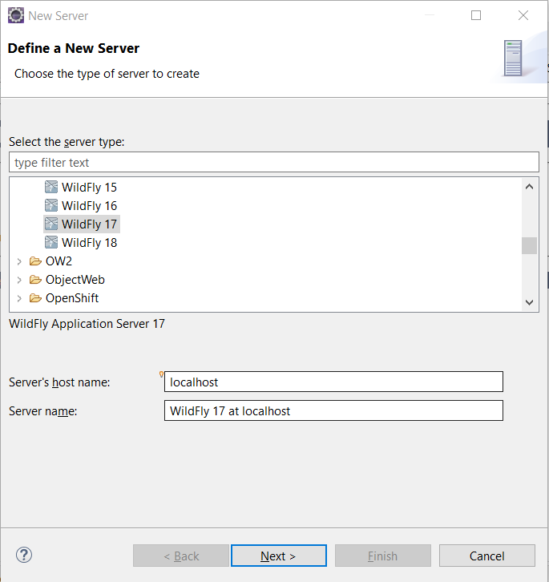
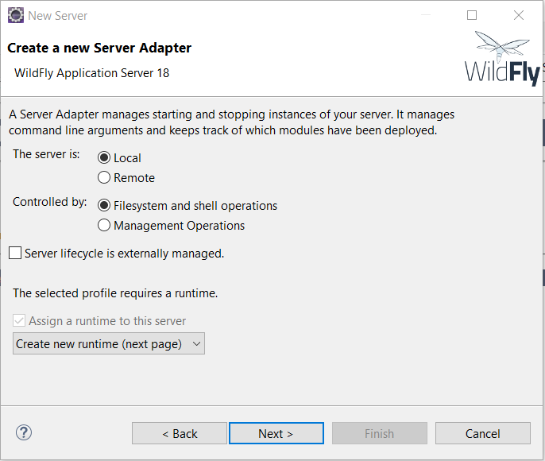
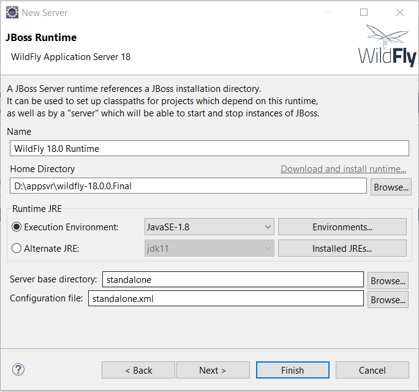
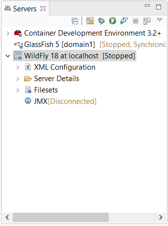
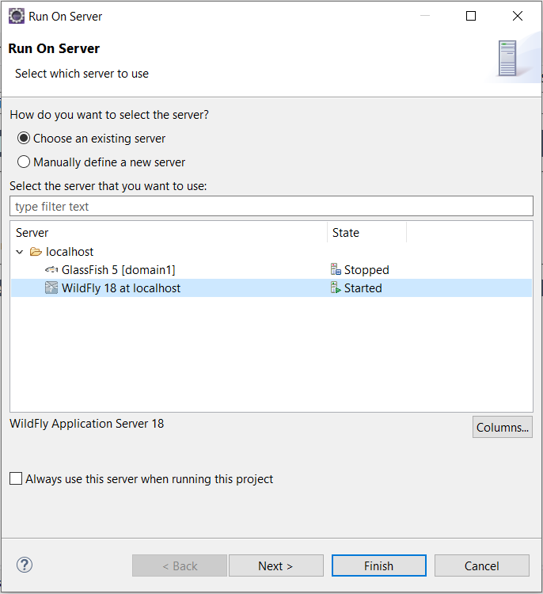

# Deploying applications to WildFly Server using Eclipse IDE

[toc]

## Install Redhat CodeReady Studio

If you installed [Redhat CodeReady Studio](https://developers.redhat.com/products/codeready-studio/overview) instead of the official Eclipse IDE, skip this step. 

Follow the following steps to  install Redhat CodeReady Studio plugin into the existing Eclipse IDE.

1. Open Eclipse Marketplace from *Help*-> *Eclipse Marketplace* menu. 
2. Click the *Redhat* icon in the bottom *Marketplaces* area of *Eclipse Marketplace* dialog to switch to *Redhat* marketplace.
3. Select *Redhat CodeReady Studio*,  click the *Install* button to install it.
4. After it is installed, restart Eclipse IDE to apply the plugin.

Next let's create a WildFly Server instance.

## Add a WildFly Server instance

Right click on the blank area in the *Servers* view, select *New*->*Server* in the context menu.




Expand *JBoss Community* node in the tree list, select WildFly 18, click *Next*  button.



In the  *Create a new Server Adapter* step, use the default selections, click *Next* button.



In the *JBoss Runtime*, select the WildFly server location in your system, click *Finish* button. 

After it is done, there is a WildFly instance in the  *Servers* view.




## Start and Stop WildFly server

To start WildFly Server, right click the WildFly node in the *Servers* view, and click *Start*  in the context menu.

To stop WildFly  Server, right click the WildFly node in the *Servers* view, and click *Stop*  in the context menu.

## Deploy and undeploy applications

Ok, let's try to run the application on WildFly server.

In the *Project* or *Packages* view, right click the project node, and click *Run As...*-> *Run on Server*.



If the Wildlfy is not started, it will start the server firstly, then build, package and deploy the application into the WildFly Server.

After it is started , open your terminal, try to access the sample endpoint `api/greeting/{name}` via `curl` command.

```bash 
curl http://localhost:8080/jakartaee8-starter/api/greeting/hantsy
{"message":"Say Hello to hantsy at 2019-12-03T16:34:59.095"}
```

To undeploy the application, just right click the *jakartaee8-starter* node under the *WildFly* instance node in the *Servers* view, and click *Remove* in the context menu. It will start undeploying the application, you can see the progress in the *Console* view.

```bash
16:36:13,619 INFO  [org.wildfly.extension.undertow] (ServerService Thread Pool -- 8) WFLYUT0022: Unregistered web context: '/jakartaee8-starter' from server 'default-server'
16:36:13,670 INFO  [org.jboss.as.server.deployment] (MSC service thread 1-5) WFLYSRV0028: Stopped deployment jakartaee8-starter.war (runtime-name: jakartaee8-starter.war) in 80ms
16:36:13,758 INFO  [org.jboss.as.server] (DeploymentScanner-threads - 1) WFLYSRV0009: Undeployed "jakartaee8-starter.war" (runtime-name: "jakartaee8-starter.war")
```

