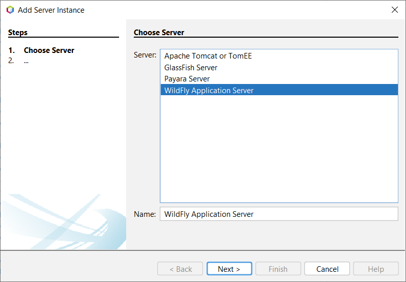
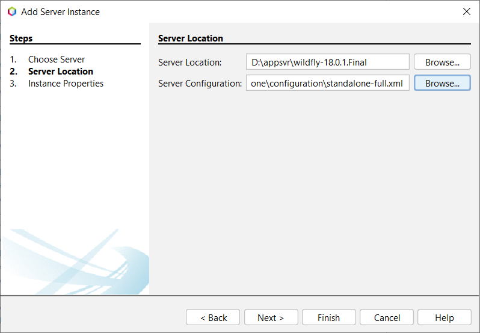
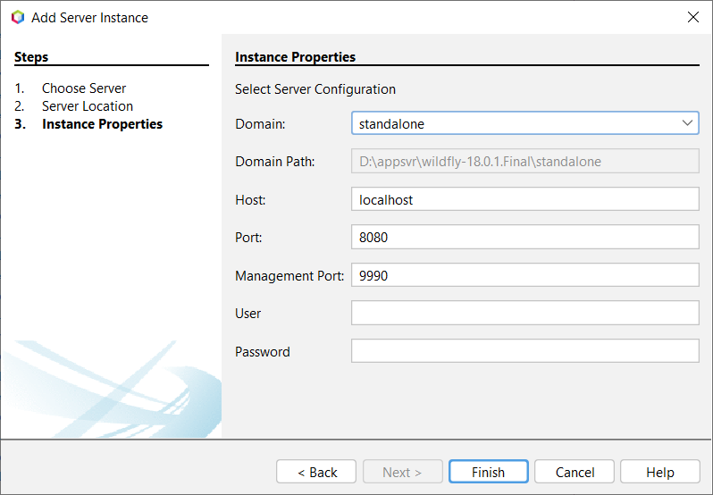
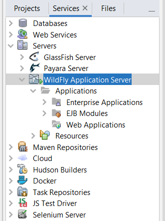
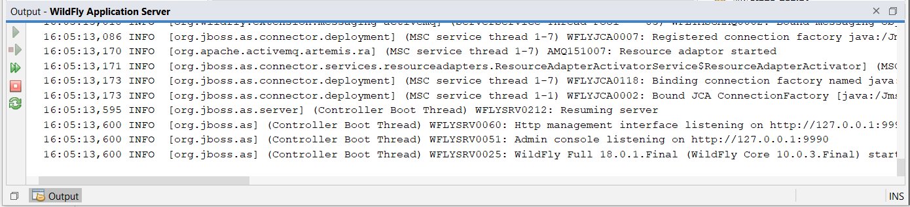
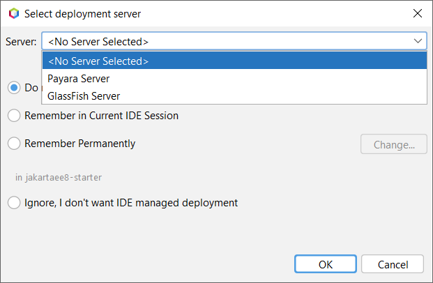
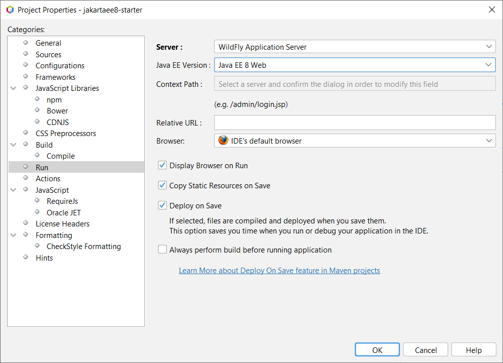
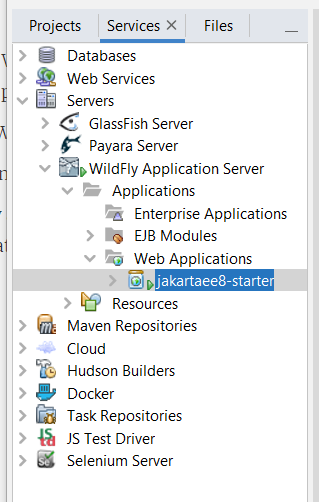

# Deploying applications to WildFly Server using Apache NetBeans IDE

NetBeans has built-in support for Glassfish.  

[toc]

## Install WildFly Application Server plugin

There is no built-in support for WildFly application server in the newest NetBeans IDE. To get WildFly integration support, follow these steps to install the WildFly plugin from NetBeans Plugin Portal.

1. Download [WildFly Application Server plugin](http://plugins.netbeans.org/plugin/76472/wildfly-application-server) from NetBeans Plugin portal.
2. Open *Plugins* dialog from NetBeans IDE main menu *Tools*->*Plugins*.
3. Switch to *Downloaded* tab, and click *Add Plugins...* button to select the downloaded plugin(a .nbm file).
4. When it is added, click *Install* button to start the installation progress.
5. Follow the wizard to complete the installation. When it is done,  restart NetBeans IDE to apply the change.

## Add a WildFly Server instance

Firstly, you should add a WildFly Server instance in NetBeans.

1. Click *Windows->Services* or use *Ctrl+5* shortcuts to open *Services* view .
2. Right click  the *Servers* node, select *Add Server...* in the context menu.
3. In the *Add Server Instance* dialog, there are three steps:
   * *Choose Server* :select *WildFly Application Server* in the server list, click *Next* button.
   
     
   
   * *Server Location*: select the WildFly server location, click *Next* button.
   
     
   
   * *Instance Properties*: use the default values, if you have set an administration user, fill them in *User* and *Password* fields, click *Finish* button.
   
     

After it is done, there is a new node *WildFly Application Server* added under the *Server*s nodes.



Right click the *WildFly Application Server* node, there is a few actions available for you to control the server instance, such as Start, Stop, Debug etc. 

## Start and Stop WildFly Server

Let's start the WildFly server by clicking *Start* in the context menu.  Wait for seconds, you will see the *Output* screen similar to the following.



To stop the running WildFly Server,  click *Stop* in the context menu of the existed WildFly Server node. Or jus click the *stop* button the *Output - Wildfly Application Server* window.

## Deploy and undeploy applications

Generally, like what we have done with Glassfish and Payara servers,  we can simply deploy and run a Jakarta EE application on an application server by simply clicking *Run* in the context menu of the project node in the *Projects* view. 

However when I try to run this application on Wildfly server, there is no such a Wildfly option in the dropdown list in the popup **Select deployment server**. It should be a bug.




To select WildFly server as target server, let's switch to  *Projects* view, right click the project node, and select *Properties* in the context menu.

In the project properties window, select *Run* in the left navigation tree,  and in the right panel, select *Wildfly Application Server*  in the **Server** dropdown list.



Click *OK* button. It will try to build the project and deploy the application package into the NetBeans managed WildFly server.   

After it is deployed successfully, there is a success message similar with the following in the *Run* tab of the *Output* window.

```bash
------------------------------------------------------------------------
Deploying on WildFly Application Server
    profile mode: false
    debug mode: false
    force redeploy: true
Starting WildFly Application Server
WildFly Application Server Started
Initial deploying jakartaee8-starter to D:\appsvr\wildfly-18.0.1.Final\standalone\deployments\jakartaee8-starter.war
Completed initial distribution of jakartaee8-starter
Deploying D:\appsvr\wildfly-18.0.1.Final\standalone\deployments\jakartaee8-starter.war
Application Deployed

```

Switch to *WildFly Application Server* console tab, you will see the following messages instead.

```bash
...
20:50:59,798 INFO  [org.jboss.as] (Controller Boot Thread) WFLYSRV0051: Admin console listening on http://127.0.0.1:9990
20:50:59,798 INFO  [org.jboss.as] (Controller Boot Thread) WFLYSRV0025: WildFly Full 18.0.1.Final (WildFly Core 10.0.3.Final) started in 13378ms - Started 355 of 618 services (385 services are lazy, passive or on-demand)
20:51:06,232 INFO  [org.jboss.as.server.deployment.scanner] (DeploymentScanner-threads - 2) WFLYDS0004: Found jakartaee8-starter.war in deployment directory. To trigger deployment create a file called jakartaee8-starter.war.dodeploy
20:51:06,284 INFO  [org.jboss.as.server.deployment] (MSC service thread 1-2) WFLYSRV0027: Starting deployment of "jakartaee8-starter.war" (runtime-name: "jakartaee8-starter.war")
20:51:08,994 INFO  [org.jboss.weld.deployer] (MSC service thread 1-7) WFLYWELD0003: Processing weld deployment jakartaee8-starter.war
20:51:09,956 INFO  [org.hibernate.validator.internal.util.Version] (MSC service thread 1-7) HV000001: Hibernate Validator 6.0.18.Final
20:51:10,670 INFO  [org.jboss.weld.Version] (MSC service thread 1-3) WELD-000900: 3.1.2 (Final)
20:51:10,797 INFO  [org.infinispan.factories.GlobalComponentRegistry] (MSC service thread 1-5) ISPN000128: Infinispan version: Infinispan 'Infinity Minus ONE +2' 9.4.16.Final
20:51:11,494 INFO  [io.smallrye.metrics] (MSC service thread 1-4) MicroProfile: Metrics activated
20:51:11,688 INFO  [org.jboss.as.clustering.infinispan] (ServerService Thread Pool -- 40) WFLYCLINF0002: Started client-mappings cache from ejb container
20:51:13,027 INFO  [org.jboss.resteasy.resteasy_jaxrs.i18n] (ServerService Thread Pool -- 40) RESTEASY002225: Deploying javax.ws.rs.core.Application: class com.example.JaxrsActivator
20:51:13,197 INFO  [org.wildfly.extension.undertow] (ServerService Thread Pool -- 40) WFLYUT0021: Registered web context: '/jakartaee8-starter' for server 'default-server'
20:51:13,312 INFO  [org.jboss.as.server] (DeploymentScanner-threads - 1) WFLYSRV0010: Deployed "jakartaee8-starter.war" (runtime-name : "jakartaee8-starter.war")

```


Let's open the *Server* view, there several nodes are displayed under WildFly Application Server. Expand the *Application*/*Web Applications* node, you will see there is a new node *jakartaee8-starter* there.



Open  your terminal and use `curl` to verify the APIs.

```bash
curl http://localhost:8080/jakartaee8-starter/api/greeting/hantsy
{"message":"Say Hello to hantsy at 2019-11-04T16:16:13.509"}
```

To  undeploy the application, in the *Service* view, expand *Servers/WildFly Application Server/Applications/Web Applications*, right click the *jakartaee8-starter* node, click *Undeploy*  to undeploy it from the WildFly server. 

