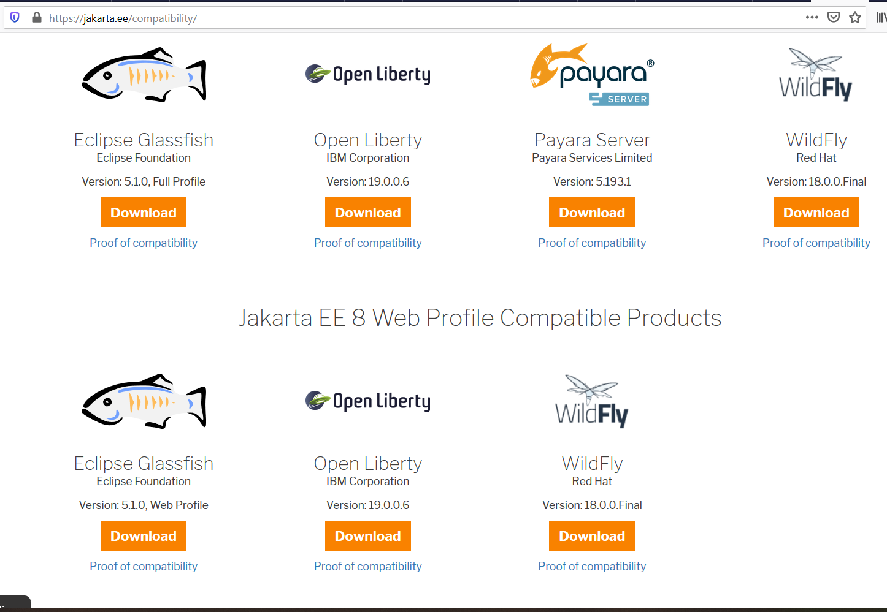

# Deploying applications to Application Servers

[ Jakarta EE Compatible Products](https://jakarta.ee/compatibility/) lists all products that compatible with the latest Jakarta EE specifications.

In this chapter, we will discuss the following topic:

* [Getting the latest Jakarta EE compatible  application servers](./03run.md)
* Deploying the applications to the popular application servers, including:
  * [Glassfish](./03run-glassfish.md)
  * [Payara](./03run-payara.md)
  * [WildFly](./03run-wildfly.md)
  * [Open Liberty](./03run-openliberty.md)

