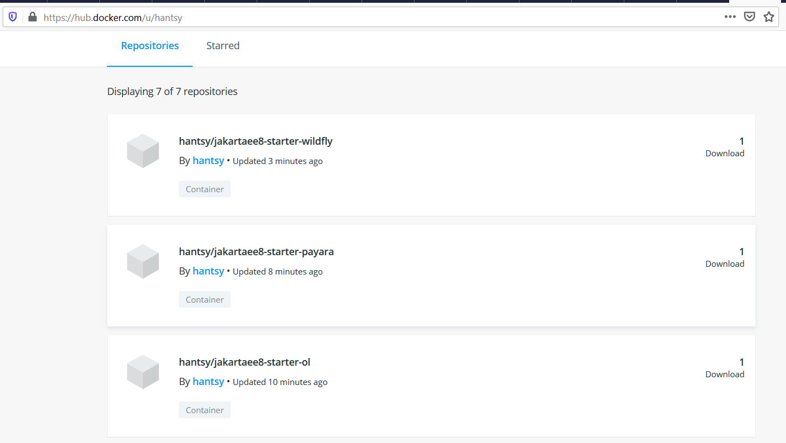
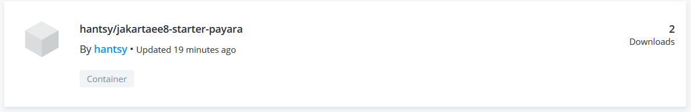

# Dockerizing Your Jakarta EE Applications

You can package the application together with application servers into a Docker image, and publish it to a private Docker register or the public Dockerhub, and it is easy to deploy the application to any container later.

## Building an Docker image with Payara Server 

Create a Dockerfile(*Dockerfile.payara*).

```dockerfile
FROM payara/server-full

COPY ./target/jakartaee8-starter.war $DEPLOY_DIR
```

Build the docker image.

```bash
$docker build -t hantsy/jakartaee8-starter-payara -f ./Dockerfile.payara .
Sending build context to Docker daemon  4.152MB
Step 1/2 : FROM payara/server-full
 ---> ec5413bd3946
Step 2/2 : COPY ./target/jakartaee8-starter.war $DEPLOY_DIR
 ---> e4050ecf1f14
Successfully built e4050ecf1f14
Successfully tagged hantsy/jakartaee8-starter-payara:latest
SECURITY WARNING: You are building a Docker image from Windows against a non-Windows Docker host. All files and directories added to build context will have '-rwxr-xr-x' permissions. It is recommended to double check and reset permissions for sensitive files and directories.
```

## Building an Docker image with WildFly Server 

Create a Dockerfile(*Dockerfile.wildfly*).

```dockerfile
FROM jboss/wildfly

# add deployment archive.
ADD ./target/jakartaee8-starter.war /opt/jboss/wildfly/standalone/deployments/

# add an admin user.
#RUN /opt/jboss/wildfly/bin/add-user.sh admin Admin#70365 --silent

# run as standalone mode.
CMD ["/opt/jboss/wildfly/bin/standalone.sh", "-b", "0.0.0.0", "-bmanagement", "0.0.0.0"]

```

Build the docker image.

```bash
$docker build -t hantsy/jakartaee8-starter-wildfly -f ./Dockerfile.wildfly .
Sending build context to Docker daemon  4.152MB
Step 1/3 : FROM jboss/wildfly
 ---> e6f71554a543
Step 2/3 : ADD ./target/jakartaee8-starter.war /opt/jboss/wildfly/standalone/deployments/
 ---> e90bf997ef55
Step 3/3 : CMD ["/opt/jboss/wildfly/bin/standalone.sh", "-b", "0.0.0.0", "-bmanagement", "0.0.0.0"]
 ---> Running in 3745f03be995
Removing intermediate container 3745f03be995
 ---> fc54079cd81d
Successfully built fc54079cd81d
Successfully tagged hantsy/jakartaee8-starter-wildfly:latest
SECURITY WARNING: You are building a Docker image from Windows against a non-Windows Docker host. All files and directories added to build context will have '-rwxr-xr-x' permissions. It is recommended to double check and reset permissions for sensitive files and directories.
```

## Building an Docker image with Open Liberty Server 

Create a Dockerfile(*Dockerfile.openliberty*).

```dockerfile
FROM open-liberty:kernel
COPY --chown=1001:0  ./target/jakartaee8-starter.war /config/dropins/
COPY --chown=1001:0  ./src/main/liberty/config/server.xml /config/
RUN configure.sh
```

Build the docker image.

```bash
$ docker build -t hantsy/jakartaee8-starter-ol -f ./Dockerfile.openliberty .
Sending build context to Docker daemon  4.152MB
Step 1/4 : FROM open-liberty:kernel
kernel: Pulling from library/open-liberty
423ae2b273f4: Already exists
de83a2304fa1: Already exists
f9a83bce3af0: Already exists
b6b53be908de: Already exists
d6eb45629ecf: Already exists
0069565d8828: Already exists
fcb1ae56a39d: Already exists
b9d7882f2a77: Already exists
50c1f11d92c8: Already exists
63110263233d: Already exists
f64e77000968: Already exists
Digest: sha256:7c999b6e50cbfa385e73a1f9344ed69534cd851b887ea95bade5fa5f88b10a64
Status: Downloaded newer image for open-liberty:kernel
 ---> 5629497aaab0
Step 2/4 : COPY --chown=1001:0  ./target/jakartaee8-starter.war /config/dropins/
 ---> dafa59ec94a8
Step 3/4 : COPY --chown=1001:0  ./src/main/liberty/config/server.xml /config/
 ---> 6b1a108ecf32
Step 4/4 : RUN configure.sh
 ---> Running in 0eaa5d85fc49
Removing intermediate container 0eaa5d85fc49
 ---> f1d6cdbe4017
Successfully built f1d6cdbe4017
Successfully tagged hantsy/jakartaee8-starter-ol:latest
SECURITY WARNING: You are building a Docker image from Windows against a non-Windows Docker host. All files and directories added to build context will have '-rwxr-xr-x' permissions. It is recommended to double check and reset permissions for sensitive files and directories.
```

## Running applications from Docker Images

Check all docker images we've  created.

```bash
$docker image ls|grep jakartaee
hantsy/jakartaee8-starter-ol        latest               f1d6cdbe4017        15 minutes ago      498MB
hantsy/jakartaee8-starter-wildfly   latest               fc54079cd81d        16 minutes ago      757MB
hantsy/jakartaee8-starter-payara    latest               e4050ecf1f14        16 minutes ago      513MB
```

Now you can run your application from Docker images directly.

```bash
$docker run -it -p 8080:8080  hantsy/jakartaee8-starter-payara
...

[#|2020-03-09T07:56:59.460+0000|INFO|Payara 5.194|fish.payara.micro.cdi.extension.ClusteredCDIEventBusImpl|_ThreadID=1;_ThreadName=main;_TimeMillis=1583740619460;_LevelValue=800;|
  Clustered CDI Event bus initialized|#]

[#|2020-03-09T07:56:59.550+0000|INFO|Payara 5.194|org.glassfish.soteria.servlet.SamRegistrationInstaller|_ThreadID=1;_ThreadName=main;_TimeMillis=1583740619550;_LevelValue=800;|
  Initializing Soteria 1.1-b01 for context '/jakartaee8-starter'|#]

[#|2020-03-09T07:56:59.838+0000|INFO|Payara 5.194|javax.enterprise.web|_ThreadID=1;_ThreadName=main;_TimeMillis=1583740619838;_LevelValue=800;_MessageID=AS-WEB-GLUE-00172;|
  Loading application [jakartaee8-starter] at [/jakartaee8-starter]|#]

[#|2020-03-09T07:57:00.043+0000|INFO|Payara 5.194|javax.enterprise.system.core|_ThreadID=1;_ThreadName=main;_TimeMillis=1583740620043;_LevelValue=800;|
  jakartaee8-starter was successfully deployed in 7,236 milliseconds.|#]

[#|2020-03-09T07:57:00.052+0000|INFO|Payara 5.194|fish.payara.boot.runtime.BootCommand|_ThreadID=1;_ThreadName=main;_TimeMillis=1583740620052;_LevelValue=800;|
  Boot Command deploy returned with result SUCCESS : PlainTextActionReporterSUCCESSDescription: deploy AdminCommandApplication deployed with name jakartaee8-starter.
    [name=jakartaee8-starter
|#]
```

When it is running successfully, open another terminal, test it by `curl` command.

```bash
$curl http://localhost:8080/jakartaee8-starter/api/greeting/Hantsy
{"message":"Say Hello to Hantsy at 2020-03-09T07:57:13.634"}
```

Let's have a try with the *WildFly*  one.

```bash
$docker run -it -p 8080:8080  hantsy/jakartaee8-starter-wildfly

=========================================================================

  JBoss Bootstrap Environment

  JBOSS_HOME: /opt/jboss/wildfly

  JAVA: /usr/lib/jvm/java/bin/java

  JAVA_OPTS:  -server -Xms64m -Xmx512m -XX:MetaspaceSize=96M -XX:MaxMetaspaceSize=256m -Djava.net.preferIPv4Stack=true -Djboss.modules.system.pkgs=org.jboss.byteman -Djava.awt.headless=true  --add-exports=java.base/sun.nio.ch=ALL-UNNAMED --add-exports=jdk.unsupported/sun.misc=ALL-UNNAMED --add-exports=jdk.unsupported/sun.reflect=ALL-UNNAMED

=========================================================================

...
08:03:15,380 INFO  [org.jboss.as.server.deployment.scanner] (MSC service thread 1-2) WFLYDS0013: Started FileSystemDeploymentService for directory /opt/jboss/wildfly/standalone/deployments
08:03:15,405 INFO  [org.jboss.as.server.deployment] (MSC service thread 1-4) WFLYSRV0027: Starting deployment of "jakartaee8-starter.war" (runtime-name: "jakartaee8-starter.war")
08:03:15,591 INFO  [org.wildfly.extension.undertow] (MSC service thread 1-1) WFLYUT0006: Undertow HTTPS listener https listening on 0.0.0.0:8443
08:03:15,731 INFO  [org.jboss.ws.common.management] (MSC service thread 1-1) JBWS022052: Starting JBossWS 5.3.0.Final (Apache CXF 3.3.3)
08:03:16,543 INFO  [org.jboss.weld.deployer] (MSC service thread 1-4) WFLYWELD0003: Processing weld deployment jakartaee8-starter.war
08:03:16,835 INFO  [org.hibernate.validator.internal.util.Version] (MSC service thread 1-4) HV000001: Hibernate Validator 6.0.18.Final
08:03:17,532 INFO  [org.jboss.weld.Version] (MSC service thread 1-2) WELD-000900: 3.1.2 (Final)
08:03:17,775 INFO  [org.infinispan.factories.GlobalComponentRegistry] (MSC service thread 1-3) ISPN000128: Infinispan version: Infinispan 'Infinity Minus ONE +2' 9.4.16.Final
08:03:18,504 INFO  [io.smallrye.metrics] (MSC service thread 1-4) MicroProfile: Metrics activated
08:03:18,805 INFO  [org.jboss.as.clustering.infinispan] (ServerService Thread Pool -- 76) WFLYCLINF0002: Started client-mappings cache from ejb container
08:03:20,260 INFO  [org.jboss.resteasy.resteasy_jaxrs.i18n] (ServerService Thread Pool -- 76) RESTEASY002225: Deploying javax.ws.rs.core.Application: class com.example.JaxrsActivator
08:03:20,364 INFO  [org.wildfly.extension.undertow] (ServerService Thread Pool -- 76) WFLYUT0021: Registered web context: '/jakartaee8-starter' for server 'default-server'
08:03:20,574 INFO  [org.jboss.as.server] (ServerService Thread Pool -- 44) WFLYSRV0010: Deployed "jakartaee8-starter.war" (runtime-name : "jakartaee8-starter.war")
08:03:20,713 INFO  [org.jboss.as.server] (Controller Boot Thread) WFLYSRV0212: Resuming server
08:03:20,718 INFO  [org.jboss.as] (Controller Boot Thread) WFLYSRV0060: Http management interface listening on http://0.0.0.0:9990/management
08:03:20,719 INFO  [org.jboss.as] (Controller Boot Thread) WFLYSRV0051: Admin console listening on http://0.0.0.0:9990
08:03:20,721 INFO  [org.jboss.as] (Controller Boot Thread) WFLYSRV0025: WildFly Full 18.0.1.Final (WildFly Core 10.0.3.Final) started in 12590ms - Started 439 of 663 services (374 services are lazy, passive or on-demand
```

Verify if it is working as expected.

```bash
$curl http://localhost:8080/jakartaee8-starter/api/greeting/Hantsy
{"message":"Say Hello to Hantsy at 2020-03-09T08:05:04.362308"}
```

Let's move to the *Open Liberty* one.

```bash
$docker run -it -p 9080:9080  hantsy/jakartaee8-starter-ol

Launching defaultServer (Open Liberty 20.0.0.2/wlp-1.0.37.cl200220200204-1746) on Eclipse OpenJ9 VM, version 1.8.0_242-b08 (en_US)
[AUDIT   ] CWWKE0001I: The server defaultServer has been launched.
[AUDIT   ] CWWKG0093A: Processing configuration drop-ins resource: /opt/ol/wlp/usr/servers/defaultServer/configDropins/defaults/keystore.xml
[AUDIT   ] CWWKG0093A: Processing configuration drop-ins resource: /opt/ol/wlp/usr/servers/defaultServer/configDropins/defaults/open-default-port.xml
[WARNING ] CWWKS3103W: There are no users defined for the BasicRegistry configuration of ID com.ibm.ws.security.registry.basic.config[basic].
[AUDIT   ] CWWKZ0058I: Monitoring dropins for applications.
[AUDIT   ] CWWKI0001I: The CORBA name server is now available at corbaloc:iiop:localhost:2809/NameService.
[AUDIT   ] CWWKT0016I: Web application available (default_host): http://100075c9c6f2:9080/jakartaee8-starter/
[AUDIT   ] CWWKZ0001I: Application jakartaee8-starter started in 1.252 seconds.
[AUDIT   ] CWWKF0012I: The server installed the following features: [appClientSupport-1.0, appSecurity-2.0, appSecurity-3.0, batch-1.0, beanValidation-2.0, cdi-2.0, concurrent-1.0, distributedMap-1.0, ejb-3.2, ejbHome-3.2, ejbLite-3.2, ejbPersistentTimer-3.2, ejbRemote-3.2, el-3.0, j2eeManagement-1.1, jacc-1.5, jaspic-1.1, javaMail-1.6, javaee-8.0, jaxb-2.2, jaxrs-2.1, jaxrsClient-2.1, jaxws-2.2, jca-1.7, jcaInboundSecurity-1.0, jdbc-4.2, jms-2.0, jndi-1.0, jpa-2.2, jpaContainer-2.2, jsf-2.3, jsonb-1.0, jsonp-1.1, jsp-2.3, managedBeans-1.0, mdb-3.2, servlet-4.0, ssl-1.0, wasJmsClient-2.0, wasJmsSecurity-1.0, wasJmsServer-1.0, webProfile-8.0, websocket-1.1].
[AUDIT   ] CWWKF0011I: The defaultServer server is ready to run a smarter planet. The defaultServer server started in 5.200 seconds.
```

Verify the sample endpiont in our application.

```bash
$curl http://localhost:9080/jakartaee8-starter/api/greeting/Hantsy
{"message":"Say Hello to Hantsy at 2020-03-09T08:09:03.152"}
```

> Open Liberty Server exposes 9080 port for HTTP service.

## Push Docker images to  DockerHub


If have registered an account of  [Docker Hub](https://hub.docker.com), you can push your Docker images to [Docker Hub](https://hub.docker.com) by `docker push ` command.

Run `docker push  hantsy/jakartaee8-starter-payara` to publish Docker image  `hantsy/jakartaee8-starter-payara` to DockerHub.

```bash
$docker push  hantsy/jakartaee8-starter-payara
The push refers to repository [docker.io/hantsy/jakartaee8-starter-payara]
921bb178c262: Pushed
557f45f3a42d: Mounted from payara/server-full
c7ef12393eb6: Mounted from payara/server-full
ba89adf982de: Mounted from payara/server-full
424c345412bc: Mounted from payara/server-full
cde479949b0d: Mounted from payara/server-full
78d551a960f0: Mounted from payara/server-full
9a104f978865: Mounted from payara/server-full
e80c789bc6ac: Mounted from payara/server-full
6c3332381368: Mounted from payara/server-full
ef1a1ec5bba9: Mounted from payara/server-full
a1aa3da2a80a: Mounted from payara/server-full
latest: digest: sha256:337660e94d6963ce16a58f9ca2da8b2baab0f091bd9f1b5c7c1f69acf2f9628c size: 2835
```
>You can also host a private Docker Registry .  Check [the documentation of Docker Registry](https://docs.docker.com/registry/) for more details.

Similarly, execute the following command to publish Docker Image `hantsy/jakartaee8-starter-wildfly` to Docker Hub.

```bash
docker push  hantsy/jakartaee8-starter-wildfly
The push refers to repository [docker.io/hantsy/jakartaee8-starter-wildfly]
5b42af22037d: Pushed
b5f0a4251c98: Mounted from jboss/wildfly
d5f70da15821: Pushed
7f8f41ff7db7: Mounted from jboss/wildfly
eb1b0155f75c: Mounted from jboss/wildfly
071d8bd76517: Mounted from jboss/wildfly
latest: digest: sha256:c6357c87bbb1030b7f0f1ba573b5117682542e9bd2401e147c953fb00664b169 size: 1582
```

Similarly,  run `docker push  hantsy/jakartaee8-starter-ol` to publish Docker Image   `hantsy/jakartaee8-starter-ol` to Docker Hub.

```bash
$docker push  hantsy/jakartaee8-starter-ol
The push refers to repository [docker.io/hantsy/jakartaee8-starter-ol]
0c6692ec3ec5: Pushed
7b813ce8e181: Pushed
f4678bd5321e: Pushed
a3ecaa325d01: Mounted from library/open-liberty
f9e4e79f5ce1: Mounted from library/open-liberty
c9c036b999a8: Mounted from library/open-liberty
372cf642b3e1: Mounted from library/open-liberty
93b48683923e: Mounted from library/open-liberty
6d67a7f26a1d: Mounted from library/open-liberty
01c4039a9616: Mounted from library/open-liberty
1852b2300972: Mounted from library/open-liberty
03c9b9f537a4: Mounted from library/open-liberty
8c98131d2d1d: Mounted from library/open-liberty
cc4590d6a718: Mounted from library/open-liberty
latest: digest: sha256:fa745c6843080fbd7b67934763f6f14d2aaa887c6232840c1d68914eba58ade1 size: 3251
```

Open a browser, and navigate to https://hub.docker.com/u/hantsy, you can see the images you have just uploaded.



> Note, in the above examples, when building the Docker images, I used **hantsy** as the prefix. Replace it with your username.

To verify the published Docker images on Docker Hub is working well, let try to create a new Docker container from the published images.

Firstly, remove the local Docker image.

```bash
$docker rmi hantsy/jakartaee8-starter-payara
Untagged: hantsy/jakartaee8-starter-payara:latest
Untagged: hantsy/jakartaee8-starter-payara@sha256:337660e94d6963ce16a58f9ca2da8b2baab0f091bd9f1b5c7c1f69acf2f9628c
Deleted: sha256:e4050ecf1f1435f638e443bb41d0977fff913a7fa3c77c6ce57a94b96d7e38d4
Deleted: sha256:9e6fdd2ca706334c753c4282d793be7ec3f65dad74582033cf8ae54ff94a7437
```

Then run a Docker container from image `hantsy/jakartaee8-starter-payara`. It will pull the Docker image from Docker Hub as expected.

```bash
$docker run -it -p 8080:8080  hantsy/jakartaee8-starter-payara
Unable to find image 'hantsy/jakartaee8-starter-payara:latest' locally
latest: Pulling from hantsy/jakartaee8-starter-payara
5667fdb72017: Already exists
d83811f270d5: Already exists
ee671aafb583: Already exists
7fc152dfb3a6: Already exists
97042bc2376a: Already exists
eb23c9217771: Already exists
fba0b3a58c5b: Already exists
adaf62e04c47: Already exists
a1b735200774: Already exists
f2ebd3f53efc: Already exists
9edcfcb81be0: Already exists
b093e94e2a28: Pull complete
...
[#|2020-03-09T08:37:59.484+0000|INFO|Payara 5.194|org.glassfish.soteria.servlet.SamRegistrationInstaller|_ThreadID=1;_ThreadName=main;_TimeMillis=1583743079484;_LevelValue=800;|
  Initializing Soteria 1.1-b01 for context '/jakartaee8-starter'|#]

[#|2020-03-09T08:37:59.838+0000|INFO|Payara 5.194|javax.enterprise.web|_ThreadID=1;_ThreadName=main;_TimeMillis=1583743079838;_LevelValue=800;_MessageID=AS-WEB-GLUE-00172;|
  Loading application [jakartaee8-starter] at [/jakartaee8-starter]|#]

[#|2020-03-09T08:38:00.113+0000|INFO|Payara 5.194|javax.enterprise.system.core|_ThreadID=1;_ThreadName=main;_TimeMillis=1583743080113;_LevelValue=800;|
  jakartaee8-starter was successfully deployed in 8,144 milliseconds.|#]

[#|2020-03-09T08:38:00.123+0000|INFO|Payara 5.194|fish.payara.boot.runtime.BootCommand|_ThreadID=1;_ThreadName=main;_TimeMillis=1583743080123;_LevelValue=800;|
  Boot Command deploy returned with result SUCCESS : PlainTextActionReporterSUCCESSDescription: deploy AdminCommandApplication deployed with name jakartaee8-starter.
    [name=jakartaee8-starter
|#]
```

Open your browser and go to  https://hub.docker.com/u/hantsy again, you will find the download counter increased.



