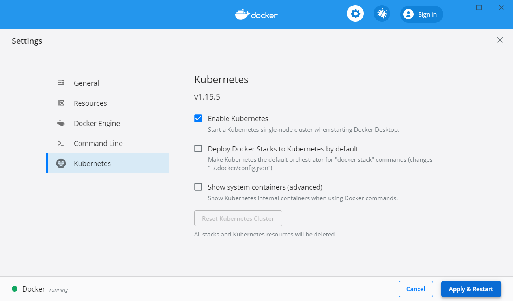
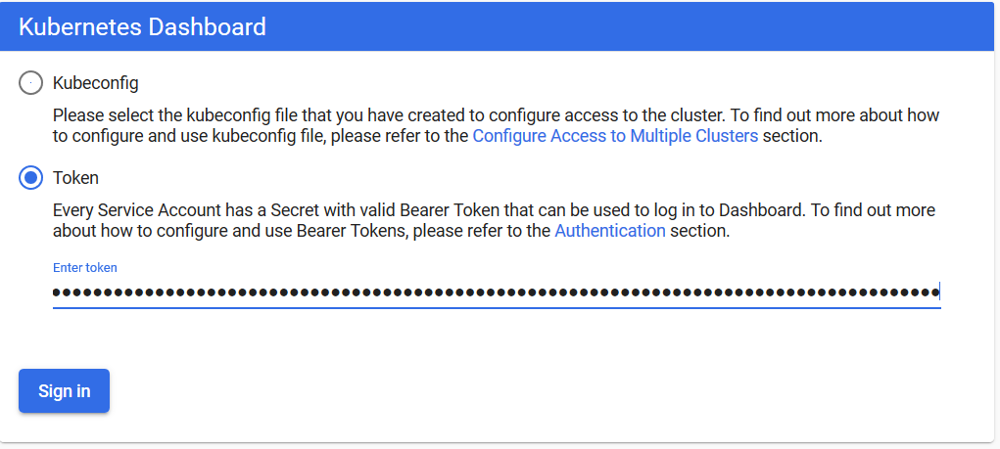
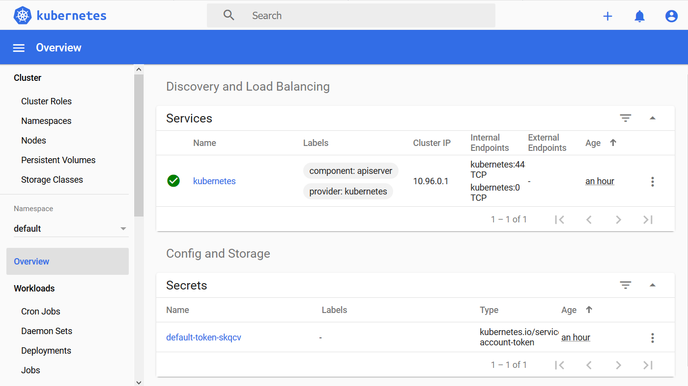
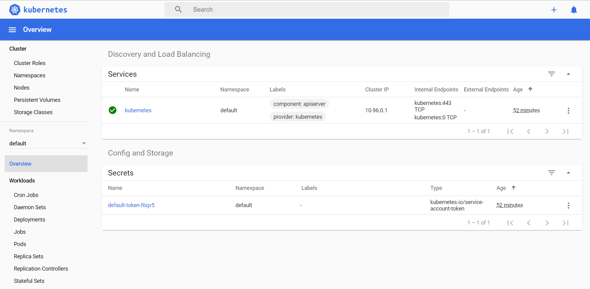
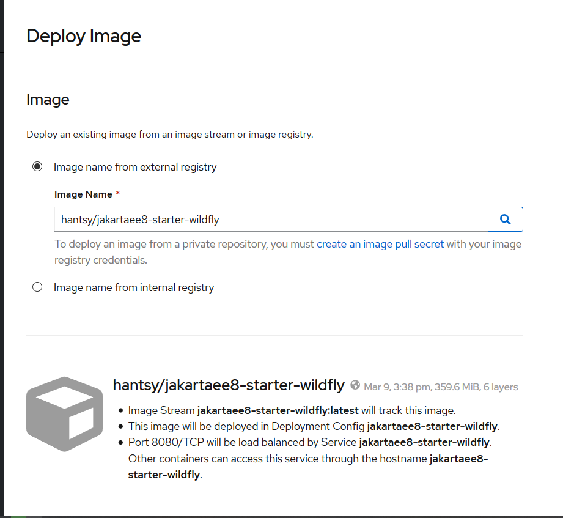
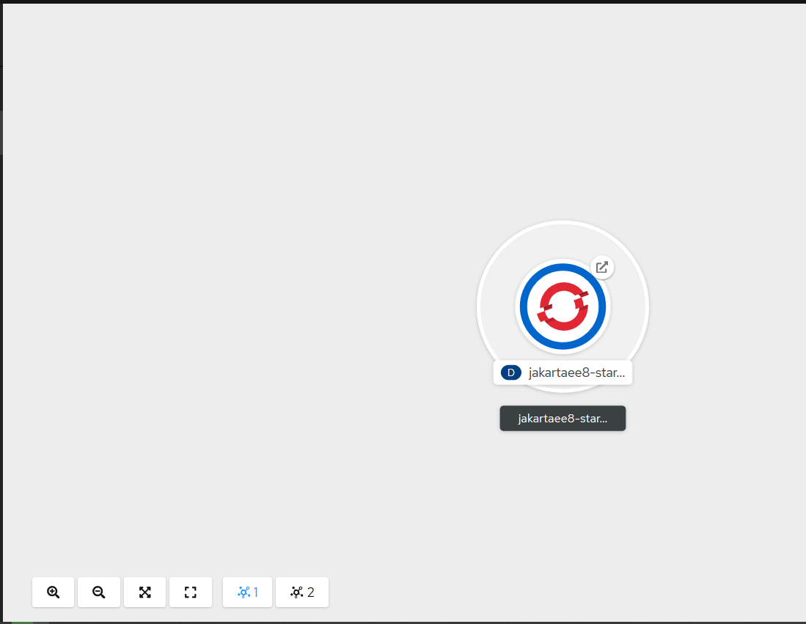
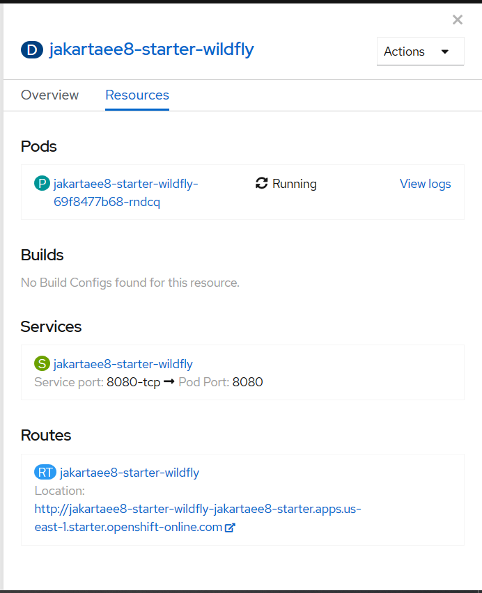
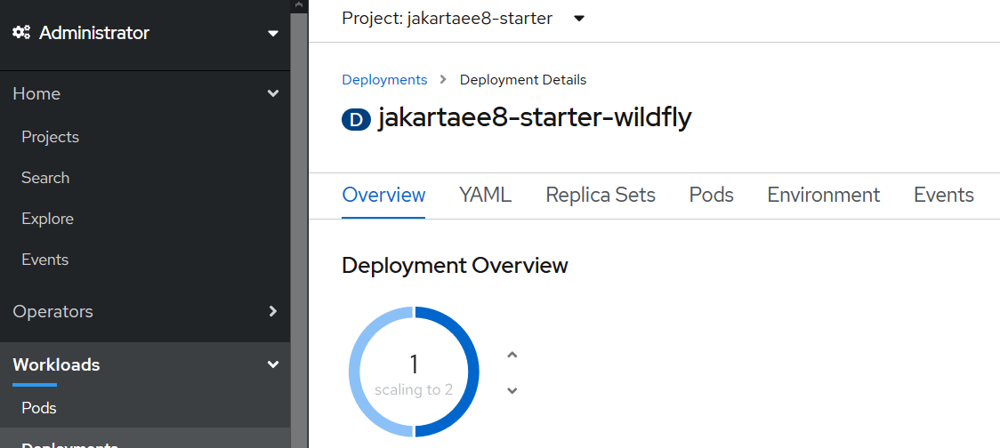

# Putting Applications to Production

After you published your applications as Docker images on DockerHub,  you can deploy it into any cloud platform that supports container. Today almost all popular cloud platform supports Kubernetes and Docker, such as OpenShift, Microsoft Azure, etc.

## Running a local Kubernetes cluster

There are a few means to get Kubernetes running in your local system, such as Docker Desktop for  Windows/MacOS, minkube, and Minishift(an OpenShift upstream project).

For Windows user, the simplest approach could be installing a copy of Docker Desktop for Windows.

### Docker Desktop

If you are using Docker Desktop for Windows or Docker Desktop for MacOS, there is no need to install an extra Kubernetes, it ships with a copy of [Kubernetes](https://docs.docker.com/docker-for-windows/#kubernetes).

To enable Kubernetes support in Docker Desktop for Windows, right click the Docker icon in the system tray, and open *Settings* from the context menu. 



Select *Kubernetes* option in the left menu panel, in the right content panel, make sure the *Enable Kubernetes* is checked, and click *Apply &  Restart* button.

Waiting  for a while, it should start a local Kubernetes cluster. 

> For Chinese users, please follow the guide of  [AliyunContainerService/k8s-for-dociker-desktop](https://github.com/AliyunContainerService/k8s-for-docker-desktop) to enable Kubernetes in your Docker Desktop.

> There are couples of issues about enabling K8S in Docker Desktop for Windows, check [Github Issues of docker/for-win](https://github.com/docker/for-win/issues).

Docker Desktop does not install Kubernetes Dashboard by default. You have to install it yourself.

```bash
$ kubectl apply -f https://raw.githubusercontent.com/kubernetes/dashboard/v2.0.0-rc5/aio/deploy/recommended.yaml
```

Check the pod status of Kubernetes Dashboard.

```bash
$ kubectl get pod -n kubernetes-dashboard
NAME                                         READY   STATUS              RESTARTS   AGE
dashboard-metrics-scraper-7b8b58dc8b-ctxzf   0/1     ContainerCreating   0          71s
kubernetes-dashboard-866f987876-qfbvp        0/1     ContainerCreating   0          71s
```

When the *STATUS* became *RUNNING*, run the following command to setup a proxy to access the dashboard.

```bash
$ kubectl proxy
Starting to serve on 127.0.0.1:8001
```

The dashboard can be accessed via url: [`http://localhost:8001/api/v1/namespaces/kubernetes-dashboard/services/https:kubernetes-dashboard:/proxy/`](http://localhost:8001/api/v1/namespaces/kubernetes-dashboard/services/https:kubernetes-dashboard:/proxy/).

By default, Kubernetes Dashboard requires a token or kubeconfig to access the dashboard page.

```bash
$ kubectl -n kubernetes-dashboard get secret
NAME                               TYPE                                  DATA   AGE
default-token-x4j76                kubernetes.io/service-account-token   3      24m
kubernetes-dashboard-certs         Opaque                                0      24m
kubernetes-dashboard-csrf          Opaque                                1      24m
kubernetes-dashboard-key-holder    Opaque                                2      24m
kubernetes-dashboard-token-7656z   kubernetes.io/service-account-token   3      24m

$ kubectl -n kubernetes-dashboard describe secrets kubernetes-dashboard-token-7656z
Name:         kubernetes-dashboard-token-7656z
Namespace:    kubernetes-dashboard
Labels:       <none>
Annotations:  kubernetes.io/service-account.name: kubernetes-dashboard
              kubernetes.io/service-account.uid: 241056aa-7a32-4ed8-8510-5c023bfa4543

Type:  kubernetes.io/service-account-token

Data
====
ca.crt:     1025 bytes
namespace:  20 bytes
token:      eyJhbGciOiJSUzI1NiIsImtpZCI6ImFCUkZNVjRkbTl5TmN6eGlYYXBGSDljMlNTLVIwQ1ZUOU96VzU0RFBwaWsifQ.eyJpc3MiOiJrdWJlcm5ldGVzL3NlcnZpY2VhY2NvdW50Iiwia3ViZXJuZXRlcy5pby9zZXJ2aWNlYWNjb3VudC9uYW1lc3BhY2UiOiJrdWJlcm5ldGVzLWRhc2hib2FyZCIsImt1YmVybmV0ZXMuaW8vc2VydmljZWFjY291bnQvc2VjcmV0Lm5hbWUiOiJrdWJlcm5ldGVzLWRhc2hib2FyZC10b2tlbi03NjU2eiIsImt1YmVybmV0ZXMuaW8vc2VydmljZWFjY291bnQvc2VydmljZS1hY2NvdW50Lm5hbWUiOiJrdWJlcm5ldGVzLWRhc2hib2FyZCIsImt1YmVybmV0ZXMuaW8vc2VydmljZWFjY291bnQvc2VydmljZS1hY2NvdW50LnVpZCI6IjI0MTA1NmFhLTdhMzItNGVkOC04NTEwLTVjMDIzYmZhNDU0MyIsInN1YiI6InN5c3RlbTpzZXJ2aWNlYWNjb3VudDprdWJlcm5ldGVzLWRhc2hib2FyZDprdWJlcm5ldGVzLWRhc2hib2FyZCJ9.OlgYkWDm3ZYd6o6w4vTtFoBcCIfU8cRuJ3Lhh8WDJ7HKd2pYkDpATSBZjrOUndnhyfYc_E1ePvOPeMcU5iy5sMA_Is2uxepDnsMOxVnd7ctV-RHdrk0ZZLCz4Mt0uvuGqGIe9ZfNzPC97fF7RsL_Lz826F-9DNRjWVniPpT3TfzgEB29OXSYVqLjbvDCimtgLd-N0NeIgWdH5MbVwUiJZsBuKsa4A65bkQ6KfzsoaSFFHz8qeEV6AG5e7CGrDUjSHXVWbp6wVj2unC__nxZM8oOF4klgTakTR_TUl5dogTtCoT02sSgMR8iOgs7DPfO4YWFPMNb6nZWefBtT5JzpzA
```

In the login page, select *Token*,  and copy the above token value to the field *Enter token* and click  *Sign in* button.



After you are logged in, it shows the Kubernetes Dashboard page for you.




### Minikube

Alternatively, you can follow [the official Kubernetes guide](https://kubernetes.io/docs/tasks/tools/install-minikube/) to install a *minikube*  manually to serve a local Kubernetes cluster. 

Once it is installed, run the following command to verify if *minikube* is installed successfully.

```bash
$ minikube version
minikube version: v1.8.1
commit: cbda04cf6bbe65e987ae52bb393c10099ab62014
```

Start *minikube*, it will preare a local Kubernetes cluster for you. If this is the first time to run minikube, it will take some time to prepare the environment.

```bash
$ minikube start

// Chinese user add --image-repository to avoid issues of accessing goolge service in China.
$  minikube start --driver=hyperv --memory=4096m --image-repository=registry.cn-hangzhou.aliyuncs.com/google_containers
```

Check minikube status.

```bash
$ minikube status
host: Running
kubelet: Running
apiserver: Running
kubeconfig: Configured
```

Start minikube dashboard.

```bash
$ minikube dashboard
* Enabling dashboard ...
* Verifying dashboard health ...
* Launching proxy ...
* Verifying proxy health ...
* Opening http://127.0.0.1:51489/api/v1/namespaces/kubernetes-dashboard/services/http:kubernetes-dashboard:/proxy/ in your default browser...
```

It will open the default browser automatically and show you the Kubernetes Dashboard page.



Stop minikube.

```bash
$ minikube stop
* Stopping "minikube" in hyperv ...
* Powering off "minikube" via SSH ...
* "m01" stopped.
```

Pause and resume minikube.

```bash
$ minikube pause

// resume a paused minikube k8s cluster.
$ minikube unpause 
```

Delete the *minikube* cluster.

```bash
$minikube delete
```

## Deploying on the local Kubernetes cluster

When a local Kubernetes cluster is ready, it is time to deploy our application into this Kubernetes cluster. 

Firstly, create a *deployment* from the docker images we have built.

```bash
$ kubectl create deployment jakartaee8-starter --image=hantsy/jakartaee8-starter-wildfly
deployment.apps/jakartaee8-starter created
```

Check  the deployments.

```bash
$ kubectl get deployments
NAME                 READY   UP-TO-DATE   AVAILABLE   AGE
jakartaee8-starter   1/1     1            1           40m
```

To access the *jakartaee8-starter* Deployment, exposes it as a Service.

```bash
$ kubectl expose deployment jakartaee8-starter --type=NodePort --port=8080
service/jakartaee8-starter exposed
```

Check the exposed services.

```bash
$ kubectl get services
NAME                 TYPE        CLUSTER-IP    EXTERNAL-IP   PORT(S)          AGE
jakartaee8-starter   NodePort    10.101.72.8   <none>        8080:32458/TCP   40m
kubernetes           ClusterIP   10.96.0.1     <none>        443/TCP          9h
```

Check the *pod* status, it will take some time to create the container.

```ba
$ kubectl get pods
NAME                                 READY   STATUS              RESTARTS   AGE
jakartaee8-starter-675889c77-pd7kw   0/1     ContainerCreating   0          3m21s
```

When the status becomes *Running*, it is ready for accessing from client.

```bash
$ kubectl get pods
NAME                                 READY   STATUS    RESTARTS   AGE
jakartaee8-starter-675889c77-pd7kw   1/1     Running   0          23m
```

Run the following command to access the sample endpoint inside the pod.

```bash
$ kubectl exec -it jakartaee8-starter-675889c77-pd7kw curl localhost:8080/jakartaee8-starter/api/greeting/Hantsy
{"message":"Say Hello to Hantsy at 2020-03-10T16:52:21.332576"}
```

To access it from external requests, firstly you should get the port of the exposed service.

Use `describe` command to get the details of the exposed Service. Kubernetes assigned a port to expose the service to external clients, here it is 32458.

```bash
$ kubectl describe services/jakartaee8-starter
Name:                     jakartaee8-starter
Namespace:                default
Labels:                   app=jakartaee8-starter
Annotations:              <none>
Selector:                 app=jakartaee8-starter
Type:                     NodePort
IP:                       10.101.72.8
Port:                     <unset>  8080/TCP
TargetPort:               8080/TCP
NodePort:                 <unset>  32458/TCP
Endpoints:                172.17.0.6:8080
Session Affinity:         None
External Traffic Policy:  Cluster
Events:                   <none>
// or get nodePort by go template
$ kubectl get services/jakartaee8-starter -o go-template='{{(index .spec.ports 0).nodePort}}'
32458
```

Get the local K8s cluster ip.

```bash
$ minikube ip
172.19.204.81
```

Now try to send a request to the sample endpoint.

```bash
$ curl http://172.19.204.81:32458/jakartaee8-starter/api/greeting/Hantsy
{"message":"Say Hello to Hantsy at 2020-03-10T16:42:23.999636}
```

Scale deployments.

```bash
$ kubectl scale --replicas=2 deployment jakartaee8-starter
deployment.apps/jakartaee8-starter scaled

$ kubectl get pods
NAME                                 READY   STATUS    RESTARTS   AGE
jakartaee8-starter-675889c77-8mngf   1/1     Running   0          37m
jakartaee8-starter-675889c77-p7kl7   1/1     Running   0          48s

```

Delete resources.

```bash
$ kubectl delete service jakartaee8-starter
$ kubectl delete deployment jakartaee8-starter
```

Simply you can create a Deployment from a defined yaml file.

```bash
$ kubectl apply -f .\deployment.yaml
deployment.apps/jakartaee8-starter created
service/jakartaee8-starter created

$ kubectl get pods
NAME                                 READY   STATUS    RESTARTS   AGE
jakartaee8-starter-675889c77-jxdgw   1/1     Running   0          16s

$ kubectl exec -it jakartaee8-starter-675889c77-jxdgw curl http://localhost:8080/jakartaee8-starter/api/greeting/Hantsy

$ kubectl delete -f .\deployment.yaml
deployment.apps "jakartaee8-starter" deleted
service "jakartaee8-starter" deleted
```

There is a simple approach to generate the yaml template, try to append  `--dry-run -o yaml` to the above `kubectl create deployment` and `kubectl expose depolyment` , it will output the yaml format of the Deployment and Service.

The following is a cleaned  sample yaml .

```yaml
apiVersion: apps/v1
kind: Deployment
metadata:
  labels:
    app: jakartaee8-starter
  name: jakartaee8-starter
spec:
  replicas: 1
  selector:
    matchLabels:
      app: jakartaee8-starter
  template:
    metadata:
      labels:
        app: jakartaee8-starter
    spec:
      containers:
      - image: hantsy/jakartaee8-starter-wildfly
        name: jakartaee8-starter-wildfly

---
apiVersion: v1
kind: Service
metadata:
  labels:
    app: jakartaee8-starter
  name: jakartaee8-starter
spec:
  ports:
  - port: 8080
    protocol: TCP
    targetPort: 8080
  selector:
    app: jakartaee8-starter
  type: NodePort
```


## Deploying on OpenShift Online

[OpenShift](https://www.openshift.com) is a leading Kubernetes container platform brought by Redhat. OpenShift  provides a 60-days community-support free starter plan for developers.

Open your browse, navigate to [https://www.openshift.com/](https://www.openshift.com/) , click the [FREE TRIAL](https://www.openshift.com/trial/), and click [Try it in the Cloud](https://manage.openshift.com/register/confirm) to register OpenShift Online. Wait some minutes, it will take some time to prepare your environment.

When it is ready, sign in to  [https://www.openshift.com/](https://www.openshift.com/), it will open up OpenShift Console.

In the console, click  *create project*  button to create a new project.


Input project name and click *Create* button.

Switch to *Developer* view.


Click **+Add**  tab,  and select *Container Image*.

 

Pull down the page, as you see, the application name and name is set by default, and make sure *Create a route to the application* checkbox is checked.


Click *Create* button to finish the form.

It will show a  page to display the application status.



Click the  icon of the core of the circle, it will popup a view to display the defailts of the application.



In the bottom of this view, copy the external link of this application. 

Open a terminal, run the following command to test the sample enpoint.

```bash
$ curl http://jakartaee8-starter-wildfly-jakartaee8-starter.apps.us-east-1.starter.openshift-online.com/jakartaee8-starter/api/greeting/Hantsy
{"message":"Say Hello to Hantsy at 2020-03-10T11:17:31.275764"}
```

It is easy to scale your deployments in the OpenShift Console. 

Switch to **Administration** mode, and click the *Workloads*/*Deployments* tab.

Click *jakartaee8-starter-wildfly* in the deployments list. 

Click the **Up** icon to scale to deployments to 2 pods. 



Click *Pods* tab in the page, you will find there are 2 pods are running.


To decrease the number of the pods. Switch the  **Overview**  tab, click **Down** icon. If you click **Pods** tab again, you will see the status of one pod becomes **Terminating** and finally removed from this page.

