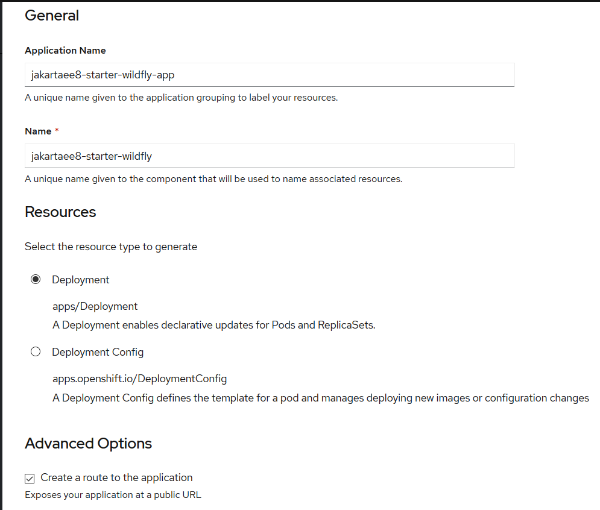

# Put to production

## Running Application Servers in Docker

In the [Deploying applications to Application Servers](./03run.md), we explored how to utilize the deployments scan to deploy a Jakarta EE application on application servers, such as [Glassfish](./03run-glassfish-m.md), [Payara](./03run-payara-m.md), [WildFly](./03run-wildfly-m.md), [Open Liberty](./03run-openliberty-m.md). 

With the deployments scan feature, it is easy to deploy a Jakarta EE application to an application server that running in a Docker container.

Assume you have installed Docker in your local development environment. If not, check the official [Docker installation guide](https://docs.docker.com/install/) to install it firstly.

### Payara Server

Once Docker is installed, you can start a Payara server with the `docker`command  quickly.

```bash
docker run -p 8080:8080 -p 4848:4848 -v ./deployments:/opt/payara/deployments payara/server-full
```

If this is your first time to run this command, it will take some seconds or minutes to download  the *payara/server-full* docker image firstly, the create a docker using *payara/server-full* image. Please be patient and drink a cup of coffee.

After it is running, copy the packaged war archive to the location *./deployments*.  The Payara server will scan the */opt/payara/deployments* in docker to deploy it automatically. 

More simply, you can start a Payara server by `docker-compose`. There is a Docker compose file  [*docker-compose.yml*](https://github.com/hantsy/jakartaee8-starter/blob/master/docker-compose.yml) available in the root of  [jakartaee8-starter](https://github.com/hantsy/jakartaee8-starter) .

Run the following command to start a Payara server using `docker-compose` command.

```bash 
docker-compose up payara
```

In the [*docker-compose.yml*](https://github.com/hantsy/jakartaee8-starter/blob/master/docker-compose.yml) , it defines a service for payara server.

```yaml
version: '3.3' # specify docker-compose version

# Define the services/containers to be run
services:
  payara:
    image: payara/server-full
    ports:
      - "8080:8080"
      - "8181:8181" # HTTPS listener
      - "4848:4848" # HTTPS admin listener
      - "9009:9009" # Debug port
    restart: always
#    environment:
#    JVM_ARGS: ""
#     - "AS_ADMIN_MASTERPASSWORD=admin" #default password is `changeit`
    volumes:
      - ./deployments:/opt/payara/deployments
```


 ### WildFly Server

Similar with Payara server, start a WildFly server with `docker` command like this.

```bash
docker run -p 8080:8080 -p 9990:9990 -v ./deployments:/opt/jboss/wildfly/standalone/deployments/ -it jboss/wildfly /opt/jboss/wildfly/bin/standalone.sh -b 0.0.0.0 -bmanagement 0.0.0.0
```

When it is running, copy *jakartaee8-starter.war* to to the location *./deployments*.  It will scan it and deploy it automatically. 

Alternatively, start a WildFly server via `docker-compose` command.

```bash
docker-compose up wildfly
```

The *wildfly* services defined in the [*docker-compose.yml*](https://github.com/hantsy/jakartaee8-starter/blob/master/docker-compose.yml).

```yaml
version: '3.3' # specify docker-compose version

# Define the services/containers to be run
services:
...
  wildfly:
    image: jboss/wildfly
    ports:
      - "8080:8080"
      - "9990:9990" # admin listener
    restart: always
    command: /opt/jboss/wildfly/bin/standalone.sh -b 0.0.0.0 -bmanagement 0.0.0.0
#    environment:
    volumes:
      - ./deployments:/opt/jboss/wildfly/standalone/deployments/   
```


### Open Liberty Server

Start a Open Liberty Server  with `docker` command.

```bash
docker run -p 9080:9080 -p 9443:9443 -v ./deployments:/config/dropins open-liberty:full
```

Instead, start a Open Liberty Server by `docker-compose` command. Define a *service* in the *docker-compose.yml* file.

```yaml
version: '3.3' # specify docker-compose version

# Define the services/containers to be run
services:
...
  openliberty:
    image: open-liberty:full
    ports:
      - "9080:9080"
      - "9443:9443" # HTTPS listener
    restart: always
#    command: configure.sh # use for open-liberty:kernel image.
#    environment:
    volumes:
      - ./deployments:/config/dropins  
```

> Unfortunately, there is no official Glassfish v5.1 in docker hub. There are some third party Glassfish docker images available, such as [adam-bien's docklands](http://www.adam-bien.com/roller/abien/entry/jakarta_ee_eclipse_glassfish_5), [jelastic/glassfish](https://hub.docker.com/r/jelastic/glassfish).

## Dockerizing your Jakarta EE applications

You can package the application together with application servers into a Docker image, and publish it to a private Docker register or the public Dockerhub, and it is easy to deploy the application to any container later.

### Building an Docker image with Payara Server 

Create a Dockerfile(*Dockerfile.payara*).

```dockerfile
FROM payara/server-full

COPY ./target/jakartaee8-starter.war $DEPLOY_DIR
```

Build the docker image.

```bash
$docker build -t hantsy/jakartaee8-starter-payara -f ./Dockerfile.payara .
Sending build context to Docker daemon  4.152MB
Step 1/2 : FROM payara/server-full
 ---> ec5413bd3946
Step 2/2 : COPY ./target/jakartaee8-starter.war $DEPLOY_DIR
 ---> e4050ecf1f14
Successfully built e4050ecf1f14
Successfully tagged hantsy/jakartaee8-starter-payara:latest
SECURITY WARNING: You are building a Docker image from Windows against a non-Windows Docker host. All files and directories added to build context will have '-rwxr-xr-x' permissions. It is recommended to double check and reset permissions for sensitive files and directories.
```

### Building an Docker image with WildFly Server 

Create a Dockerfile(*Dockerfile.wildfly*).

```dockerfile
FROM jboss/wildfly

# add deployment archive.
ADD ./target/jakartaee8-starter.war /opt/jboss/wildfly/standalone/deployments/

# add an admin user.
#RUN /opt/jboss/wildfly/bin/add-user.sh admin Admin#70365 --silent

# run as standalone mode.
CMD ["/opt/jboss/wildfly/bin/standalone.sh", "-b", "0.0.0.0", "-bmanagement", "0.0.0.0"]

```

Build the docker image.

```bash
$docker build -t hantsy/jakartaee8-starter-wildfly -f ./Dockerfile.wildfly .
Sending build context to Docker daemon  4.152MB
Step 1/3 : FROM jboss/wildfly
 ---> e6f71554a543
Step 2/3 : ADD ./target/jakartaee8-starter.war /opt/jboss/wildfly/standalone/deployments/
 ---> e90bf997ef55
Step 3/3 : CMD ["/opt/jboss/wildfly/bin/standalone.sh", "-b", "0.0.0.0", "-bmanagement", "0.0.0.0"]
 ---> Running in 3745f03be995
Removing intermediate container 3745f03be995
 ---> fc54079cd81d
Successfully built fc54079cd81d
Successfully tagged hantsy/jakartaee8-starter-wildfly:latest
SECURITY WARNING: You are building a Docker image from Windows against a non-Windows Docker host. All files and directories added to build context will have '-rwxr-xr-x' permissions. It is recommended to double check and reset permissions for sensitive files and directories.
```

### Building an Docker image with Open Liberty Server 

Create a Dockerfile(*Dockerfile.openliberty*).

```dockerfile
FROM open-liberty:kernel
COPY --chown=1001:0  ./target/jakartaee8-starter.war /config/dropins/
COPY --chown=1001:0  ./src/main/liberty/config/server.xml /config/
RUN configure.sh
```

Build the docker image.

```bash
$ docker build -t hantsy/jakartaee8-starter-ol -f ./Dockerfile.openliberty .
Sending build context to Docker daemon  4.152MB
Step 1/4 : FROM open-liberty:kernel
kernel: Pulling from library/open-liberty
423ae2b273f4: Already exists
de83a2304fa1: Already exists
f9a83bce3af0: Already exists
b6b53be908de: Already exists
d6eb45629ecf: Already exists
0069565d8828: Already exists
fcb1ae56a39d: Already exists
b9d7882f2a77: Already exists
50c1f11d92c8: Already exists
63110263233d: Already exists
f64e77000968: Already exists
Digest: sha256:7c999b6e50cbfa385e73a1f9344ed69534cd851b887ea95bade5fa5f88b10a64
Status: Downloaded newer image for open-liberty:kernel
 ---> 5629497aaab0
Step 2/4 : COPY --chown=1001:0  ./target/jakartaee8-starter.war /config/dropins/
 ---> dafa59ec94a8
Step 3/4 : COPY --chown=1001:0  ./src/main/liberty/config/server.xml /config/
 ---> 6b1a108ecf32
Step 4/4 : RUN configure.sh
 ---> Running in 0eaa5d85fc49
Removing intermediate container 0eaa5d85fc49
 ---> f1d6cdbe4017
Successfully built f1d6cdbe4017
Successfully tagged hantsy/jakartaee8-starter-ol:latest
SECURITY WARNING: You are building a Docker image from Windows against a non-Windows Docker host. All files and directories added to build context will have '-rwxr-xr-x' permissions. It is recommended to double check and reset permissions for sensitive files and directories.
```

### Running applications from Docker images

Check all docker images we've  created.

```bash
$docker image ls|grep jakartaee
hantsy/jakartaee8-starter-ol        latest               f1d6cdbe4017        15 minutes ago      498MB
hantsy/jakartaee8-starter-wildfly   latest               fc54079cd81d        16 minutes ago      757MB
hantsy/jakartaee8-starter-payara    latest               e4050ecf1f14        16 minutes ago      513MB
```

Now you can run your application from Docker images directly.

```bash
$docker run -it -p 8080:8080  hantsy/jakartaee8-starter-payara
...

[#|2020-03-09T07:56:59.460+0000|INFO|Payara 5.194|fish.payara.micro.cdi.extension.ClusteredCDIEventBusImpl|_ThreadID=1;_ThreadName=main;_TimeMillis=1583740619460;_LevelValue=800;|
  Clustered CDI Event bus initialized|#]

[#|2020-03-09T07:56:59.550+0000|INFO|Payara 5.194|org.glassfish.soteria.servlet.SamRegistrationInstaller|_ThreadID=1;_ThreadName=main;_TimeMillis=1583740619550;_LevelValue=800;|
  Initializing Soteria 1.1-b01 for context '/jakartaee8-starter'|#]

[#|2020-03-09T07:56:59.838+0000|INFO|Payara 5.194|javax.enterprise.web|_ThreadID=1;_ThreadName=main;_TimeMillis=1583740619838;_LevelValue=800;_MessageID=AS-WEB-GLUE-00172;|
  Loading application [jakartaee8-starter] at [/jakartaee8-starter]|#]

[#|2020-03-09T07:57:00.043+0000|INFO|Payara 5.194|javax.enterprise.system.core|_ThreadID=1;_ThreadName=main;_TimeMillis=1583740620043;_LevelValue=800;|
  jakartaee8-starter was successfully deployed in 7,236 milliseconds.|#]

[#|2020-03-09T07:57:00.052+0000|INFO|Payara 5.194|fish.payara.boot.runtime.BootCommand|_ThreadID=1;_ThreadName=main;_TimeMillis=1583740620052;_LevelValue=800;|
  Boot Command deploy returned with result SUCCESS : PlainTextActionReporterSUCCESSDescription: deploy AdminCommandApplication deployed with name jakartaee8-starter.
    [name=jakartaee8-starter
|#]
```

When it is running successfully, open another terminal, test it by `curl` command.

```bash
$curl http://localhost:8080/jakartaee8-starter/api/greeting/Hantsy
{"message":"Say Hello to Hantsy at 2020-03-09T07:57:13.634"}
```

Let's have a try with the *WildFly*  one.

```bash
$docker run -it -p 8080:8080  hantsy/jakartaee8-starter-wildfly

=========================================================================

  JBoss Bootstrap Environment

  JBOSS_HOME: /opt/jboss/wildfly

  JAVA: /usr/lib/jvm/java/bin/java

  JAVA_OPTS:  -server -Xms64m -Xmx512m -XX:MetaspaceSize=96M -XX:MaxMetaspaceSize=256m -Djava.net.preferIPv4Stack=true -Djboss.modules.system.pkgs=org.jboss.byteman -Djava.awt.headless=true  --add-exports=java.base/sun.nio.ch=ALL-UNNAMED --add-exports=jdk.unsupported/sun.misc=ALL-UNNAMED --add-exports=jdk.unsupported/sun.reflect=ALL-UNNAMED

=========================================================================

...
08:03:15,380 INFO  [org.jboss.as.server.deployment.scanner] (MSC service thread 1-2) WFLYDS0013: Started FileSystemDeploymentService for directory /opt/jboss/wildfly/standalone/deployments
08:03:15,405 INFO  [org.jboss.as.server.deployment] (MSC service thread 1-4) WFLYSRV0027: Starting deployment of "jakartaee8-starter.war" (runtime-name: "jakartaee8-starter.war")
08:03:15,591 INFO  [org.wildfly.extension.undertow] (MSC service thread 1-1) WFLYUT0006: Undertow HTTPS listener https listening on 0.0.0.0:8443
08:03:15,731 INFO  [org.jboss.ws.common.management] (MSC service thread 1-1) JBWS022052: Starting JBossWS 5.3.0.Final (Apache CXF 3.3.3)
08:03:16,543 INFO  [org.jboss.weld.deployer] (MSC service thread 1-4) WFLYWELD0003: Processing weld deployment jakartaee8-starter.war
08:03:16,835 INFO  [org.hibernate.validator.internal.util.Version] (MSC service thread 1-4) HV000001: Hibernate Validator 6.0.18.Final
08:03:17,532 INFO  [org.jboss.weld.Version] (MSC service thread 1-2) WELD-000900: 3.1.2 (Final)
08:03:17,775 INFO  [org.infinispan.factories.GlobalComponentRegistry] (MSC service thread 1-3) ISPN000128: Infinispan version: Infinispan 'Infinity Minus ONE +2' 9.4.16.Final
08:03:18,504 INFO  [io.smallrye.metrics] (MSC service thread 1-4) MicroProfile: Metrics activated
08:03:18,805 INFO  [org.jboss.as.clustering.infinispan] (ServerService Thread Pool -- 76) WFLYCLINF0002: Started client-mappings cache from ejb container
08:03:20,260 INFO  [org.jboss.resteasy.resteasy_jaxrs.i18n] (ServerService Thread Pool -- 76) RESTEASY002225: Deploying javax.ws.rs.core.Application: class com.example.JaxrsActivator
08:03:20,364 INFO  [org.wildfly.extension.undertow] (ServerService Thread Pool -- 76) WFLYUT0021: Registered web context: '/jakartaee8-starter' for server 'default-server'
08:03:20,574 INFO  [org.jboss.as.server] (ServerService Thread Pool -- 44) WFLYSRV0010: Deployed "jakartaee8-starter.war" (runtime-name : "jakartaee8-starter.war")
08:03:20,713 INFO  [org.jboss.as.server] (Controller Boot Thread) WFLYSRV0212: Resuming server
08:03:20,718 INFO  [org.jboss.as] (Controller Boot Thread) WFLYSRV0060: Http management interface listening on http://0.0.0.0:9990/management
08:03:20,719 INFO  [org.jboss.as] (Controller Boot Thread) WFLYSRV0051: Admin console listening on http://0.0.0.0:9990
08:03:20,721 INFO  [org.jboss.as] (Controller Boot Thread) WFLYSRV0025: WildFly Full 18.0.1.Final (WildFly Core 10.0.3.Final) started in 12590ms - Started 439 of 663 services (374 services are lazy, passive or on-demand
```

Verify if it is working as expected.

```bash
$curl http://localhost:8080/jakartaee8-starter/api/greeting/Hantsy
{"message":"Say Hello to Hantsy at 2020-03-09T08:05:04.362308"}
```

Let's move to the *Open Liberty* one.

```bash
$docker run -it -p 9080:9080  hantsy/jakartaee8-starter-ol

Launching defaultServer (Open Liberty 20.0.0.2/wlp-1.0.37.cl200220200204-1746) on Eclipse OpenJ9 VM, version 1.8.0_242-b08 (en_US)
[AUDIT   ] CWWKE0001I: The server defaultServer has been launched.
[AUDIT   ] CWWKG0093A: Processing configuration drop-ins resource: /opt/ol/wlp/usr/servers/defaultServer/configDropins/defaults/keystore.xml
[AUDIT   ] CWWKG0093A: Processing configuration drop-ins resource: /opt/ol/wlp/usr/servers/defaultServer/configDropins/defaults/open-default-port.xml
[WARNING ] CWWKS3103W: There are no users defined for the BasicRegistry configuration of ID com.ibm.ws.security.registry.basic.config[basic].
[AUDIT   ] CWWKZ0058I: Monitoring dropins for applications.
[AUDIT   ] CWWKI0001I: The CORBA name server is now available at corbaloc:iiop:localhost:2809/NameService.
[AUDIT   ] CWWKT0016I: Web application available (default_host): http://100075c9c6f2:9080/jakartaee8-starter/
[AUDIT   ] CWWKZ0001I: Application jakartaee8-starter started in 1.252 seconds.
[AUDIT   ] CWWKF0012I: The server installed the following features: [appClientSupport-1.0, appSecurity-2.0, appSecurity-3.0, batch-1.0, beanValidation-2.0, cdi-2.0, concurrent-1.0, distributedMap-1.0, ejb-3.2, ejbHome-3.2, ejbLite-3.2, ejbPersistentTimer-3.2, ejbRemote-3.2, el-3.0, j2eeManagement-1.1, jacc-1.5, jaspic-1.1, javaMail-1.6, javaee-8.0, jaxb-2.2, jaxrs-2.1, jaxrsClient-2.1, jaxws-2.2, jca-1.7, jcaInboundSecurity-1.0, jdbc-4.2, jms-2.0, jndi-1.0, jpa-2.2, jpaContainer-2.2, jsf-2.3, jsonb-1.0, jsonp-1.1, jsp-2.3, managedBeans-1.0, mdb-3.2, servlet-4.0, ssl-1.0, wasJmsClient-2.0, wasJmsSecurity-1.0, wasJmsServer-1.0, webProfile-8.0, websocket-1.1].
[AUDIT   ] CWWKF0011I: The defaultServer server is ready to run a smarter planet. The defaultServer server started in 5.200 seconds.
```

Verify the sample endpiont in our application.

```bash
$curl http://localhost:9080/jakartaee8-starter/api/greeting/Hantsy
{"message":"Say Hello to Hantsy at 2020-03-09T08:09:03.152"}
```

> Open Liberty Server exposes 9080 port for HTTP service.

### Push Docker images to  DockerHub

You can publish the Docker images to your private Docker registry, check [Docker Registry](https://docs.docker.com/registry/) to serve a private Docker registry.

If have registered an account of  [Docker Hub](https://hub.docker.com), you can push your Docker images to DockerHub by `docker push ` command.

Run `docker push  hantsy/jakartaee8-starter-payara` to publish Docker image  `hantsy/jakartaee8-starter-payara` to DockerHub.

```bash
$docker push  hantsy/jakartaee8-starter-payara
The push refers to repository [docker.io/hantsy/jakartaee8-starter-payara]
921bb178c262: Pushed
557f45f3a42d: Mounted from payara/server-full
c7ef12393eb6: Mounted from payara/server-full
ba89adf982de: Mounted from payara/server-full
424c345412bc: Mounted from payara/server-full
cde479949b0d: Mounted from payara/server-full
78d551a960f0: Mounted from payara/server-full
9a104f978865: Mounted from payara/server-full
e80c789bc6ac: Mounted from payara/server-full
6c3332381368: Mounted from payara/server-full
ef1a1ec5bba9: Mounted from payara/server-full
a1aa3da2a80a: Mounted from payara/server-full
latest: digest: sha256:337660e94d6963ce16a58f9ca2da8b2baab0f091bd9f1b5c7c1f69acf2f9628c size: 2835
```

Run `docker push  hantsy/jakartaee8-starter-wildfly` to publish Docker image  `hantsy/jakartaee8-starter-wildfly` to DockerHub.

```bash
docker push  hantsy/jakartaee8-starter-wildfly
The push refers to repository [docker.io/hantsy/jakartaee8-starter-wildfly]
5b42af22037d: Pushed
b5f0a4251c98: Mounted from jboss/wildfly
d5f70da15821: Pushed
7f8f41ff7db7: Mounted from jboss/wildfly
eb1b0155f75c: Mounted from jboss/wildfly
071d8bd76517: Mounted from jboss/wildfly
latest: digest: sha256:c6357c87bbb1030b7f0f1ba573b5117682542e9bd2401e147c953fb00664b169 size: 1582
```

Run `docker push  hantsy/jakartaee8-starter-ol` to publish Docker image  `hantsy/jakartaee8-starter-ol` to DockerHub.

```bash
$docker push  hantsy/jakartaee8-starter-ol
The push refers to repository [docker.io/hantsy/jakartaee8-starter-ol]
0c6692ec3ec5: Pushed
7b813ce8e181: Pushed
f4678bd5321e: Pushed
a3ecaa325d01: Mounted from library/open-liberty
f9e4e79f5ce1: Mounted from library/open-liberty
c9c036b999a8: Mounted from library/open-liberty
372cf642b3e1: Mounted from library/open-liberty
93b48683923e: Mounted from library/open-liberty
6d67a7f26a1d: Mounted from library/open-liberty
01c4039a9616: Mounted from library/open-liberty
1852b2300972: Mounted from library/open-liberty
03c9b9f537a4: Mounted from library/open-liberty
8c98131d2d1d: Mounted from library/open-liberty
cc4590d6a718: Mounted from library/open-liberty
latest: digest: sha256:fa745c6843080fbd7b67934763f6f14d2aaa887c6232840c1d68914eba58ade1 size: 3251
```

Open a browser, and navigate to https://hub.docker.com/u/hantsy, you can see the images you have just uploaded.


> Note, in the above examples, when building the Docker images, I used **hantsy** as the prefix. Replace it with your username.

To verify the published Docker images on DockerHub is working well, let try to create a new Docker container from published images.

Firstly, remove the local Docker image.

```bash
$docker rmi hantsy/jakartaee8-starter-payara
Untagged: hantsy/jakartaee8-starter-payara:latest
Untagged: hantsy/jakartaee8-starter-payara@sha256:337660e94d6963ce16a58f9ca2da8b2baab0f091bd9f1b5c7c1f69acf2f9628c
Deleted: sha256:e4050ecf1f1435f638e443bb41d0977fff913a7fa3c77c6ce57a94b96d7e38d4
Deleted: sha256:9e6fdd2ca706334c753c4282d793be7ec3f65dad74582033cf8ae54ff94a7437
```

Then run a Docker container from image `hantsy/jakartaee8-starter-payara`. It will pull the Docker image from DockerHub firstly.

```bash
$docker run -it -p 8080:8080  hantsy/jakartaee8-starter-payara
Unable to find image 'hantsy/jakartaee8-starter-payara:latest' locally
latest: Pulling from hantsy/jakartaee8-starter-payara
5667fdb72017: Already exists
d83811f270d5: Already exists
ee671aafb583: Already exists
7fc152dfb3a6: Already exists
97042bc2376a: Already exists
eb23c9217771: Already exists
fba0b3a58c5b: Already exists
adaf62e04c47: Already exists
a1b735200774: Already exists
f2ebd3f53efc: Already exists
9edcfcb81be0: Already exists
b093e94e2a28: Pull complete
...
[#|2020-03-09T08:37:59.484+0000|INFO|Payara 5.194|org.glassfish.soteria.servlet.SamRegistrationInstaller|_ThreadID=1;_ThreadName=main;_TimeMillis=1583743079484;_LevelValue=800;|
  Initializing Soteria 1.1-b01 for context '/jakartaee8-starter'|#]

[#|2020-03-09T08:37:59.838+0000|INFO|Payara 5.194|javax.enterprise.web|_ThreadID=1;_ThreadName=main;_TimeMillis=1583743079838;_LevelValue=800;_MessageID=AS-WEB-GLUE-00172;|
  Loading application [jakartaee8-starter] at [/jakartaee8-starter]|#]

[#|2020-03-09T08:38:00.113+0000|INFO|Payara 5.194|javax.enterprise.system.core|_ThreadID=1;_ThreadName=main;_TimeMillis=1583743080113;_LevelValue=800;|
  jakartaee8-starter was successfully deployed in 8,144 milliseconds.|#]

[#|2020-03-09T08:38:00.123+0000|INFO|Payara 5.194|fish.payara.boot.runtime.BootCommand|_ThreadID=1;_ThreadName=main;_TimeMillis=1583743080123;_LevelValue=800;|
  Boot Command deploy returned with result SUCCESS : PlainTextActionReporterSUCCESSDescription: deploy AdminCommandApplication deployed with name jakartaee8-starter.
    [name=jakartaee8-starter
|#]
```

Open  https://hub.docker.com/u/hantsy again, you will find the download counter increased.


## Putting applications to production

After you published your applications as Docker images on DockerHub,  you can deploy it into any cloud platform that supports container. Today almost all popular cloud platform supports Kubernetes and Docker, such as OpenShift, Microsoft Azure, etc.

### Running a local Kubernetes cluster

There are a few means to get Kubernetes running in your local system, such as Docker Desktop for  Windows/MacOS, minkube, and Minishift(an OpenShift upstream project).

For Windows user, the simplest approach could be installing a copy of Docker Desktop for Windows.

#### Docker Desktop for Windows/MacOS

If you are using Docker Desktop for Windows or Docker Desktop for MacOS, there is no need to install an extra Kubernetes, it ships with a copy of [Kubernetes](https://docs.docker.com/docker-for-windows/#kubernetes).

To enable Kubernetes support in Docker Desktop for Windows, right click the Docker icon in the system tray, and open *Settings* from the context menu. 


Select *Kubernetes* option in the left menu panel, in the right content panel, make sure the *Enable Kubernetes* is checked, and click *Apply &  Restart* button.

Waiting  for a while, it should start a local Kubernetes cluster for you. For Chinese users, please follow the guide of  [AliyunContainerService/k8s-for-dociker-desktop](https://github.com/AliyunContainerService/k8s-for-docker-desktop) to enable Kubernetes in Docker Desktop.

> There are couples of issues about enabling K8S in Docker Desktop for Windows, check [Github Issues of docker/for-win](https://github.com/docker/for-win/issues).

Docker Desktop does not install Kubernetes Dashboard by default.

```bash
$ kubectl apply -f https://raw.githubusercontent.com/kubernetes/dashboard/v2.0.0-rc5/aio/deploy/recommended.yaml
```

Check the pod status of Kubernetes Dashboard.

```bash
$ kubectl get pod -n kubernetes-dashboard
NAME                                         READY   STATUS              RESTARTS   AGE
dashboard-metrics-scraper-7b8b58dc8b-ctxzf   0/1     ContainerCreating   0          71s
kubernetes-dashboard-866f987876-qfbvp        0/1     ContainerCreating   0          71s
```

When the *STATUS* became *RUNNING*, run the following command to setup a proxy to access the dashboard.

```bash
$ kubectl proxy
Starting to serve on 127.0.0.1:8001
```

The dashboard can be accessed via url: [`http://localhost:8001/api/v1/namespaces/kubernetes-dashboard/services/https:kubernetes-dashboard:/proxy/`](http://localhost:8001/api/v1/namespaces/kubernetes-dashboard/services/https:kubernetes-dashboard:/proxy/).

By default, Kubernetes Dashboard requires a token or kubeconfig to access the dashboard page.

```bash
$ kubectl -n kubernetes-dashboard get secret
NAME                               TYPE                                  DATA   AGE
default-token-x4j76                kubernetes.io/service-account-token   3      24m
kubernetes-dashboard-certs         Opaque                                0      24m
kubernetes-dashboard-csrf          Opaque                                1      24m
kubernetes-dashboard-key-holder    Opaque                                2      24m
kubernetes-dashboard-token-7656z   kubernetes.io/service-account-token   3      24m

$ kubectl -n kubernetes-dashboard describe secrets kubernetes-dashboard-token-7656z
Name:         kubernetes-dashboard-token-7656z
Namespace:    kubernetes-dashboard
Labels:       <none>
Annotations:  kubernetes.io/service-account.name: kubernetes-dashboard
              kubernetes.io/service-account.uid: 241056aa-7a32-4ed8-8510-5c023bfa4543

Type:  kubernetes.io/service-account-token

Data
====
ca.crt:     1025 bytes
namespace:  20 bytes
token:      eyJhbGciOiJSUzI1NiIsImtpZCI6ImFCUkZNVjRkbTl5TmN6eGlYYXBGSDljMlNTLVIwQ1ZUOU96VzU0RFBwaWsifQ.eyJpc3MiOiJrdWJlcm5ldGVzL3NlcnZpY2VhY2NvdW50Iiwia3ViZXJuZXRlcy5pby9zZXJ2aWNlYWNjb3VudC9uYW1lc3BhY2UiOiJrdWJlcm5ldGVzLWRhc2hib2FyZCIsImt1YmVybmV0ZXMuaW8vc2VydmljZWFjY291bnQvc2VjcmV0Lm5hbWUiOiJrdWJlcm5ldGVzLWRhc2hib2FyZC10b2tlbi03NjU2eiIsImt1YmVybmV0ZXMuaW8vc2VydmljZWFjY291bnQvc2VydmljZS1hY2NvdW50Lm5hbWUiOiJrdWJlcm5ldGVzLWRhc2hib2FyZCIsImt1YmVybmV0ZXMuaW8vc2VydmljZWFjY291bnQvc2VydmljZS1hY2NvdW50LnVpZCI6IjI0MTA1NmFhLTdhMzItNGVkOC04NTEwLTVjMDIzYmZhNDU0MyIsInN1YiI6InN5c3RlbTpzZXJ2aWNlYWNjb3VudDprdWJlcm5ldGVzLWRhc2hib2FyZDprdWJlcm5ldGVzLWRhc2hib2FyZCJ9.OlgYkWDm3ZYd6o6w4vTtFoBcCIfU8cRuJ3Lhh8WDJ7HKd2pYkDpATSBZjrOUndnhyfYc_E1ePvOPeMcU5iy5sMA_Is2uxepDnsMOxVnd7ctV-RHdrk0ZZLCz4Mt0uvuGqGIe9ZfNzPC97fF7RsL_Lz826F-9DNRjWVniPpT3TfzgEB29OXSYVqLjbvDCimtgLd-N0NeIgWdH5MbVwUiJZsBuKsa4A65bkQ6KfzsoaSFFHz8qeEV6AG5e7CGrDUjSHXVWbp6wVj2unC__nxZM8oOF4klgTakTR_TUl5dogTtCoT02sSgMR8iOgs7DPfO4YWFPMNb6nZWefBtT5JzpzA
```

In the login page, select *Token*,  and copy the above token value to the field *Enter token* and click  *Sign in* button.


When you are logged in, it will show the Dashboard page for you.


#### Minikube

Alternatively, you can follow [the official Kubernetes guide](https://kubernetes.io/docs/tasks/tools/install-minikube/) to install a *minikube*  manually to serve a local Kubernetes cluster. 

Onnce it is installed, run the following command to verify *minikube* is installed.

```bash
$ minikube version
minikube version: v1.8.1
commit: cbda04cf6bbe65e987ae52bb393c10099ab62014
```

Start *minikube*. If this is the first time to run minikube, it will take some time to prepare the environment.

```bash
$ minikube start

// Chinese user add --image-repository to avoid issues of accessing goolge service in China.
$  minikube start --driver=hyperv --memory=4096m --image-repository=registry.cn-hangzhou.aliyuncs.com/google_containers
```

Check minikube status.

```bash
$ minikube status
host: Running
kubelet: Running
apiserver: Running
kubeconfig: Configured
```

Start minikube dashboard.

```bash
$ minikube dashboard
* Enabling dashboard ...
* Verifying dashboard health ...
* Launching proxy ...
* Verifying proxy health ...
* Opening http://127.0.0.1:51489/api/v1/namespaces/kubernetes-dashboard/services/http:kubernetes-dashboard:/proxy/ in your default browser...
```

It will open the default browser automatically and show you the K8S dashboard page.


Stop minikube.

```bash
$ minikube stop
* Stopping "minikube" in hyperv ...
* Powering off "minikube" via SSH ...
* "m01" stopped.
```

Pause and resume minikube.

```bash
$ minikube pause

// resume a paused minikube k8s cluster.
$ minikube unpause 
```

Delete the *minikube* cluster.

```bash
$minikube delete
```

#### Deploying on the local Kubernetes cluster

When a local Kubernetes cluster is ready, it is time to deploy our application into this Kubernetes cluster. 

Firstly, create a *deployment* from the docker images we have built.

```bash
$ kubectl create deployment jakartaee8-starter --image=hantsy/jakartaee8-starter-wildfly
deployment.apps/jakartaee8-starter created
```

Check  the deployments.

```bash
$ kubectl get deployments
NAME                 READY   UP-TO-DATE   AVAILABLE   AGE
jakartaee8-starter   1/1     1            1           40m
```

To access the *jakartaee8-starter* Deployment, exposes it as a Service.

```bash
$ kubectl expose deployment jakartaee8-starter --type=NodePort --port=8080
service/jakartaee8-starter exposed
```
Check the exposed services.

```bash
$ kubectl get services
NAME                 TYPE        CLUSTER-IP    EXTERNAL-IP   PORT(S)          AGE
jakartaee8-starter   NodePort    10.101.72.8   <none>        8080:32458/TCP   40m
kubernetes           ClusterIP   10.96.0.1     <none>        443/TCP          9h
```

Check the *pod* status, it will take some time to prepare the container creating.

```ba
$ kubectl get pods
NAME                                 READY   STATUS              RESTARTS   AGE
jakartaee8-starter-675889c77-pd7kw   0/1     ContainerCreating   0          3m21s
```

When the status becomes *Running*, it is ready for accessing from client.

```bash
$ kubectl get pods
NAME                                 READY   STATUS    RESTARTS   AGE
jakartaee8-starter-675889c77-pd7kw   1/1     Running   0          23m
```

Accessing the sample endpoint inside the pod.

```bash
$ kubectl exec -it jakartaee8-starter-675889c77-pd7kw curl localhost:8080/jakartaee8-starter/api/greeting/Hantsy
{"message":"Say Hello to Hantsy at 2020-03-10T16:52:21.332576"}
```

To access it from external requests, you check get the port of the exposed service.

Get the details of the exposed Service. Kubernetes assigned a port to expose the service, here it is 32458.

```bash
$ kubectl describe services/jakartaee8-starter
Name:                     jakartaee8-starter
Namespace:                default
Labels:                   app=jakartaee8-starter
Annotations:              <none>
Selector:                 app=jakartaee8-starter
Type:                     NodePort
IP:                       10.101.72.8
Port:                     <unset>  8080/TCP
TargetPort:               8080/TCP
NodePort:                 <unset>  32458/TCP
Endpoints:                172.17.0.6:8080
Session Affinity:         None
External Traffic Policy:  Cluster
Events:                   <none>
// or get nodePort by go template
$ kubectl get services/jakartaee8-starter -o go-template='{{(index .spec.ports 0).nodePort}}'
32458
```

Get the local K8s cluster ip.

```bash
$ minikube ip
172.19.204.81
```

Accessing the sample endpoint.

```bash
$ curl http://172.19.204.81:32458/jakartaee8-starter/api/greeting/Hantsy
{"message":"Say Hello to Hantsy at 2020-03-10T16:42:23.999636}
```

Scale deployments.

```bash
$ kubectl scale --replicas=2 deployment jakartaee8-starter
deployment.apps/jakartaee8-starter scaled

$ kubectl get pods
NAME                                 READY   STATUS    RESTARTS   AGE
jakartaee8-starter-675889c77-8mngf   1/1     Running   0          37m
jakartaee8-starter-675889c77-p7kl7   1/1     Running   0          48s

```

Delete resources.

```bash
$ kubectl delete service jakartaee8-starter
$ kubectl delete deployment jakartaee8-starter
```

Simply you can create a deployment from a yaml file.

```bash
$ kubectl apply -f .\deployment.yaml
deployment.apps/jakartaee8-starter created
service/jakartaee8-starter created

$ kubectl get pods
NAME                                 READY   STATUS    RESTARTS   AGE
jakartaee8-starter-675889c77-jxdgw   1/1     Running   0          16s

$ kubectl exec -it jakartaee8-starter-675889c77-jxdgw curl http://localhost:8080/jakartaee8-starter/api/greeting/Hantsy

$ kubectl delete -f .\deployment.yaml
deployment.apps "jakartaee8-starter" deleted
service "jakartaee8-starter" deleted
```

Add `--dry-run -o yaml` to `kubectl create deployment` and `kubectl expose depolyment` to generate the yaml template. The following is a cleaned  sample yaml .

```yaml
apiVersion: apps/v1
kind: Deployment
metadata:
  labels:
    app: jakartaee8-starter
  name: jakartaee8-starter
spec:
  replicas: 1
  selector:
    matchLabels:
      app: jakartaee8-starter
  template:
    metadata:
      labels:
        app: jakartaee8-starter
    spec:
      containers:
      - image: hantsy/jakartaee8-starter-wildfly
        name: jakartaee8-starter-wildfly

---
apiVersion: v1
kind: Service
metadata:
  labels:
    app: jakartaee8-starter
  name: jakartaee8-starter
spec:
  ports:
  - port: 8080
    protocol: TCP
    targetPort: 8080
  selector:
    app: jakartaee8-starter
  type: NodePort
```


### Deploying on OpenShift Online

[OpenShift](https://www.openshift.com) is a leading Kubernetes container platform brought by Redhat. 

Open your browse, navigate to [https://www.openshift.com/](https://www.openshift.com/) , click the [FREE TRIAL](https://www.openshift.com/trial/), and click [Try it in the Cloud](https://manage.openshift.com/register/confirm) to register OpenShift Online, it includes a 60-days community-support free starter plan for developers.  Wait some minutes, it will take some time to prepare your environment.

When it is ready, sign in to  [https://www.openshift.com/](https://www.openshift.com/), it will open up OpenShift Console.

In the console, click  *create project*  button to create a new project.


Input project name and click *Create* button.

Switch to *Developer* view.


Click **+Add**  tab,  and select *Container Image*.

 

Pull down the page, check application name and name is set, and make sure *Create a route to the application* checkbox is checked.



Click *Create* button to finish the form.

It will show a  page to display the application status.


Click the  icon of the core of the circle, it will popup a view to display the defailts of the application.


In the bottom of this view, copy the external link of this application. 

Open a terminal, run the following command to test the sample enpoint.

```bash
$ curl http://jakartaee8-starter-wildfly-jakartaee8-starter.apps.us-east-1.starter.openshift-online.com/jakartaee8-starter/api/greeting/Hantsy
{"message":"Say Hello to Hantsy at 2020-03-10T11:17:31.275764"}
```

It is easy to scale your deployments in the OpenShift Console. 

Switch to **Administration** mode, and click the *Workloads*/*Deployments* tab.

Click *jakartaee8-starter-wildfly* in the deployments list. 

Click the **Up** icon to scale to deployments to 2 pods. 


Click *Pods* tab in the page, you will find there are 2 pods are running.


To decrease the number of the pods. Switch the  **Overview**  tab, click **Down** icon. If you click **Pods** tab again, you will see the status of one pod becomes **Terminating** and finally removed from this page.

